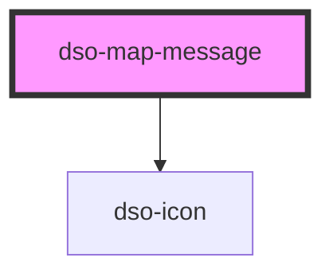

# `<dso-map-message>`

<!-- Auto Generated Below -->

## Properties

| Property               | Attribute | Description                                    | Type                                                 | Default     |
| ---------------------- | --------- | ---------------------------------------------- | ---------------------------------------------------- | ----------- |
| `variant` _(required)_ | `variant` | Variant determines the icon and actions shown. | `"error" \| "instruction" \| "success" \| undefined` | `undefined` |

## Slots

| Slot        | Description                                                    |
| ----------- | -------------------------------------------------------------- |
| `"actions"` | Optional action controls shown for success and error variants. |
| `"message"` | The message content announced as status/alert text.            |

## Dependencies

### Depends on

- [dso-icon](../icon)

### Graph

```mermaid
graph TD;
  dso-map-message --> dso-icon
  style dso-map-message fill:#f9f,stroke:#333,stroke-width:4px
```

----------------------------------------------

*Built with [StencilJS](https://stenciljs.com/)*
