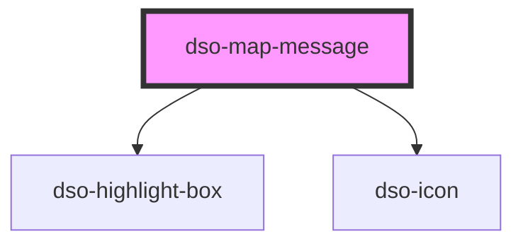

# `<dso-map-message>`

Toont een status- of foutmelding op kaartoverlays, met ondersteuning voor instructie-, succes- en foutmeldingen.

<!-- Auto Generated Below -->

## Properties

| Property  | Attribute | Description                                                              | Type                                    | Default         |
| --------- | --------- | ------------------------------------------------------------------------ | --------------------------------------- | --------------- |
| `variant` | `variant` | Variant determines the icon and actions shown. Default is "instruction". | `"error" \| "instruction" \| "success"` | `"instruction"` |

## Slots

| Slot       | Description                                                      |
| ---------- | ---------------------------------------------------------------- |
| `message`  | The message content, announced as status/alert text.             |
| `actions`  | (Optional) Action controls, shown for success and error variants.|

## Dependencies

### Depends on

- [dso-highlight-box](../highlight-box)
- [dso-icon](../icon)

### Graph

```mermaid
graph TD;
  dso-map-message --> dso-highlight-box
  dso-map-message --> dso-icon
  style dso-map-message fill:#f9f,stroke:#333,stroke-width:4px
```

----------------------------------------------

*Built with [StencilJS](https://stenciljs.com/)*
