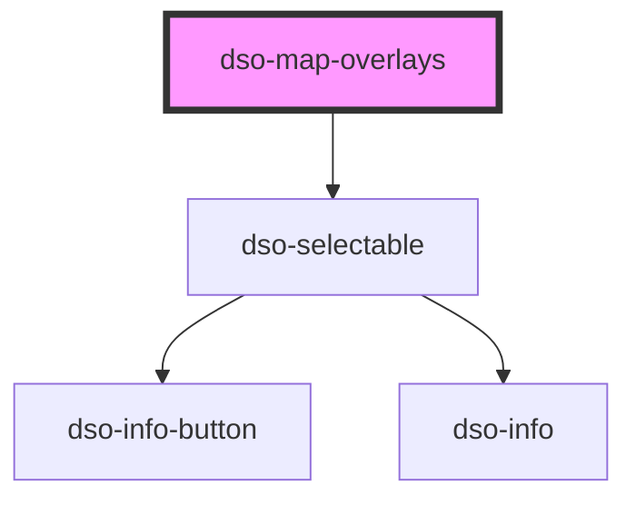

# dso-map-overlays

<!-- Auto Generated Below -->

## Properties

| Property                | Attribute | Description | Type        | Default     |
| ----------------------- | --------- | ----------- | ----------- | ----------- |
| `checkedOverlays`       | --        |             | `Overlay[]` | `[]`        |
| `overlays` _(required)_ | --        |             | `Overlay[]` | `undefined` |

## Events

| Event                   | Description | Type                     |
| ----------------------- | ----------- | ------------------------ |
| `checkedOverlaysChange` |             | `CustomEvent<Overlay[]>` |

## Dependencies

### Depends on

- [dso-selectable](../selectable)

### Graph

----------------------------------------------

*Built with [StencilJS](https://stenciljs.com/)*
