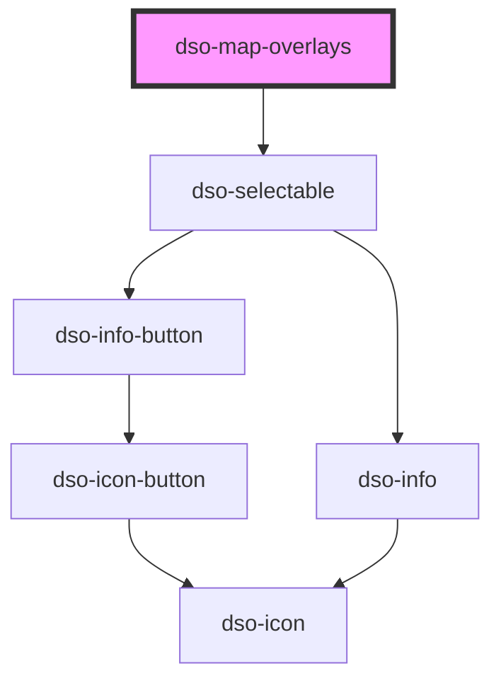

# `<dso-map-overlays>`

Private component, do not use.

<!-- Auto Generated Below -->

## Properties

| Property                | Attribute  | Description                                                           | Type        | Default     |
| ----------------------- | ---------- | --------------------------------------------------------------------- | ----------- | ----------- |
| `group`                 | `group`    | To group the overlays together. Generally the default value suffices. | `string`    | `uuidv4()`  |
| `overlays` _(required)_ | `overlays` | The overlays.                                                         | `Overlay[]` | `undefined` |

## Events

| Event              | Description                                        | Type                              |
| ------------------ | -------------------------------------------------- | --------------------------------- |
| `dsoToggleOverlay` | Emitted when the user selects a different overlay. | `CustomEvent<OverlayChangeEvent>` |

## Dependencies

### Depends on

- [dso-selectable](../selectable)

### Graph

----------------------------------------------

*Built with [StencilJS](https://stenciljs.com/)*
