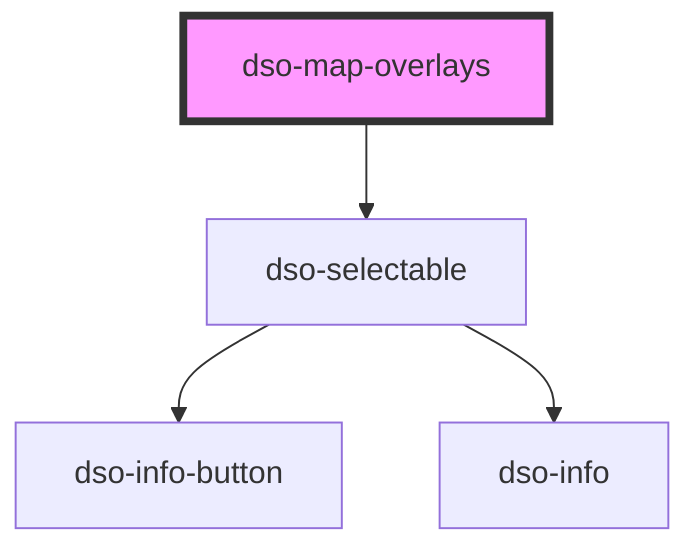

# dso-map-overlays

Private component, do not use.

<!-- Auto Generated Below -->

## Properties

| Property                | Attribute | Description | Type        | Default     |
| ----------------------- | --------- | ----------- | ----------- | ----------- |
| `overlays` _(required)_ | --        |             | `Overlay[]` | `undefined` |

## Events

| Event           | Description | Type                              |
| --------------- | ----------- | --------------------------------- |
| `toggleOverlay` |             | `CustomEvent<OverlayChangeEvent>` |

## Dependencies

### Depends on

- [dso-selectable](../selectable)

### Graph

----------------------------------------------

*Built with [StencilJS](https://stenciljs.com/)*
