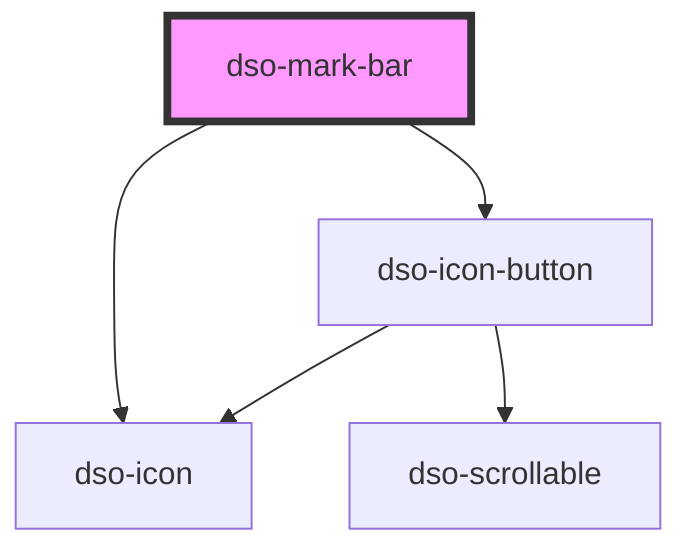

# `<dso-mark-bar>`

<!-- Auto Generated Below -->

## Properties

| Property     | Attribute     | Description                                      | Type                  | Default                |
| ------------ | ------------- | ------------------------------------------------ | --------------------- | ---------------------- |
| `current`    | `current`     | The current (one-based) highlighted search item. | `number \| undefined` | `undefined`            |
| `label`      | `label`       | The label for the input field.                   | `string`              | `"Zoeken in document"` |
| `totalCount` | `total-count` | Total number of search results.                  | `number \| undefined` | `undefined`            |
| `value`      | `value`       | The current search value.                        | `string \| undefined` | `undefined`            |

## Events

| Event         | Description                                                  | Type                                  |
| ------------- | ------------------------------------------------------------ | ------------------------------------- |
| `dsoClear`    | Emitted when user activates "clear search result" button.    | `CustomEvent<MarkBarClearEvent>`      |
| `dsoInput`    | Emitted each time the user types in the search field.        | `CustomEvent<MarkBarInputEvent>`      |
| `dsoNext`     | Emitted when user activates "next search result" button.     | `CustomEvent<MarkBarPaginationEvent>` |
| `dsoPrevious` | Emitted when user activates "previous search result" button. | `CustomEvent<MarkBarPaginationEvent>` |

## Methods

### `dsoFocus(options?: MarkBarFocusOptions) => Promise<void>`

Focuses the input field.

#### Parameters

| Name      | Type                  | Description |
| --------- | --------------------- | ----------- |
| `options` | `MarkBarFocusOptions` |             |

#### Returns

Type: `Promise<void>`

## Dependencies

### Depends on

- [dso-icon](../icon)
- [dso-icon-button](../icon-button)

### Graph

----------------------------------------------

*Built with [StencilJS](https://stenciljs.com/)*
