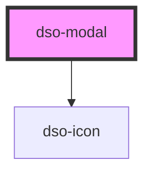

# dso-modal

Bij het instantieren van een `dso-modal` wordt op de body `.dso-modal-open` gezet. Deze class zorgt ervoor dat het scrollgedrag 'achter' de modal wordt uitgezet. Als afnemer kun je dus een modal starten door `<dso-modal>` pas te renderen als je een modal wil.

Modal kan op 2 manieren worden ingezet. De traditionele manier door het `<DsoModal>` element te plaatsen of met een controller.

```
const controller = new ModalController();

const instance = controller.createInstance({
  title: "Een titel",
  body: "<p>Hallo</p>",
  footer: "<button>Bevestig</button>"
});

instance.addEventListener("dsoClose", () => instance.close());
```

Het openen van de modal gaat met `instance.open()`.

<!-- Auto Generated Below -->


## Properties

| Property          | Attribute           | Description                                                                                                                                                                                                                         | Type                  | Default     |
| ----------------- | ------------------- | ----------------------------------------------------------------------------------------------------------------------------------------------------------------------------------------------------------------------------------- | --------------------- | ----------- |
| `initialFocus`    | `initial-focus`     | Selector used to query the element which will be focused when the component instantiated. When undefined the modal focuses the first button.dso-primary in the modal footer. If no button can be found the close button is focused. | `string \| undefined` | `undefined` |
| `modalTitle`      | `modal-title`       |                                                                                                                                                                                                                                     | `string \| undefined` | `undefined` |
| `role`            | `role`              | the role for the modal `dialog` \| `alert` \| `alertdialog` defaults to `dialog`                                                                                                                                                    | `string`              | `"dialog"`  |
| `showCloseButton` | `show-close-button` | when `false` the close button in the header will not be rendered. Defaults to `true`                                                                                                                                                | `boolean`             | `true`      |


## Events

| Event      | Description | Type                              |
| ---------- | ----------- | --------------------------------- |
| `dsoClose` |             | `CustomEvent<DsoModalCloseEvent>` |


## Dependencies

### Depends on

- [dso-icon](../icon)

### Graph


----------------------------------------------

*Built with [StencilJS](https://stenciljs.com/)*
