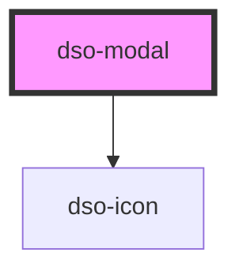

# dso-modal

Bij het instantieren van een `dso-modal` wordt op de body `.dso-modal-open` gezet. Deze class zorgt ervoor dat het scrollgedrag 'achter' de modal wordt uitgezet. Als afnemer kun je dus een modal starten door `<dso-modal>` pas te renderen als je een modal wil.

<!-- Auto Generated Below -->

## Properties

| Property     | Attribute     | Description                                                                      | Type                                   | Default     |
| ------------ | ------------- | -------------------------------------------------------------------------------- | -------------------------------------- | ----------- |
| `modalTitle` | `modal-title` |                                                                                  | `string \| undefined`                  | `undefined` |
| `role`       | `role`        | the role for the modal `dialog` \| `alert` \| `alertdialog` defaults to `dialog` | `"alert" \| "alertdialog" \| "dialog"` | `"dialog"`  |

## Events

| Event      | Description | Type                              |
| ---------- | ----------- | --------------------------------- |
| `dsoClose` |             | `CustomEvent<DsoModalCloseEvent>` |

## Dependencies

### Depends on

- [dso-icon](../icon)

### Graph

----------------------------------------------

*Built with [StencilJS](https://stenciljs.com/)*
