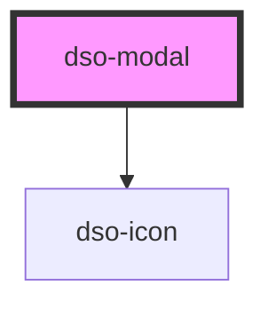

# dso-modal

**Let op: het los plaatsen van `<dso-modal>` wordt sterk afgeraden. Maak gebruik van de `DsoModalController`.**

## DsoModalController

Het gebruiken van het Modal component kan zo:

Injecteren van `ModalController`:

```
  private controller: DsoModalController = new DsoModalController();
```

De controller heeft één functie `open` met 2 parameters.

- Modal
  - title: `string` \*optioneel
  - body: `HtmlElement | string`
  - title: `HtmlElement | string` \*optioneel
- Options \*optioneel
  - role: `ModalRole ("alert" | "dialog" | "alertdialog")`
  - showCloseButton: `boolean`
  - initialFocus: `string`

Voorbeeld:

```
modalRef = this.modalController.open({
  title: 'DSO Angular Modal',
  body: ModalBodyComponent,
  footer: ModalFooterComponent,
},
{
  showCloseButton: true,
})
```

### DsoModalRef

De `open` functie van de controller geeft een `DsoModalRef` terug. Deze ref bevat de functie `close` om de modal te sluiten en de functies `addEventListener` en `removeEventlistener` om naar het `dsoClose` event te luisteren. `modalRef.addEventListener('dsoClose', () => modalRef.close())`


<!-- Auto Generated Below -->


## Properties

| Property          | Attribute           | Description                                                                                                                                                                                                                         | Type                  | Default     |
| ----------------- | ------------------- | ----------------------------------------------------------------------------------------------------------------------------------------------------------------------------------------------------------------------------------- | --------------------- | ----------- |
| `initialFocus`    | `initial-focus`     | Selector used to query the element which will be focused when the component instantiated. When undefined the modal focuses the first button.dso-primary in the modal footer. If no button can be found the close button is focused. | `string \| undefined` | `undefined` |
| `modalTitle`      | `modal-title`       |                                                                                                                                                                                                                                     | `string \| undefined` | `undefined` |
| `role`            | `role`              | the role for the modal `dialog` \| `alert` \| `alertdialog` defaults to `dialog`                                                                                                                                                    | `string`              | `"dialog"`  |
| `showCloseButton` | `show-close-button` | when `false` the close button in the header will not be rendered. Defaults to `true`                                                                                                                                                | `boolean`             | `true`      |


## Events

| Event      | Description | Type                              |
| ---------- | ----------- | --------------------------------- |
| `dsoClose` |             | `CustomEvent<DsoModalCloseEvent>` |


## Dependencies

### Depends on

- [dso-icon](../icon)

### Graph


----------------------------------------------

*Built with [StencilJS](https://stenciljs.com/)*
