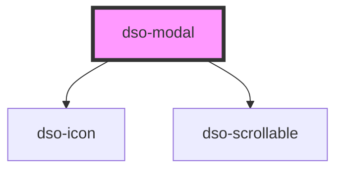

# dso-modal

Bij het instantieren van een `dso-modal` wordt op de body `.dso-modal-open` gezet. Deze class zorgt ervoor dat het scrollgedrag 'achter' de modal wordt uitgezet. Als afnemer kun je dus een modal starten door `<dso-modal>` pas te renderen als je een modal wil.

<!-- Auto Generated Below -->

## Properties

| Property          | Attribute           | Description                                                                                                                                                                                                                         | Type                   | Default     |
| ----------------- | ------------------- | ----------------------------------------------------------------------------------------------------------------------------------------------------------------------------------------------------------------------------------- | ---------------------- | ----------- |
| `fullscreen`      | `fullscreen`        | when set the modal will be shown in fullscreen.                                                                                                                                                                                     | `boolean \| undefined` | `undefined` |
| `initialFocus`    | `initial-focus`     | Selector used to query the element which will be focused when the component instantiated. When undefined the modal focuses the first button.dso-primary in the modal footer. If no button can be found the close button is focused. | `string \| undefined`  | `undefined` |
| `modalTitle`      | `modal-title`       | The title of the Modal.                                                                                                                                                                                                             | `string \| undefined`  | `undefined` |
| `role`            | `role`              | the role for the modal `dialog` \| `alert` \| `alertdialog`.                                                                                                                                                                        | `null \| string`       | `"dialog"`  |
| `showCloseButton` | `show-close-button` | when `false` the close button in the header will not be rendered. Defaults to `true`.                                                                                                                                               | `boolean`              | `true`      |

## Events

| Event      | Description                                     | Type                              |
| ---------- | ----------------------------------------------- | --------------------------------- |
| `dsoClose` | Emitted when the user wants to close the Modal. | `CustomEvent<DsoModalCloseEvent>` |

## Dependencies

### Depends on

- [dso-icon](../icon)
- [dso-scrollable](../scrollable)

### Graph

----------------------------------------------

*Built with [StencilJS](https://stenciljs.com/)*
