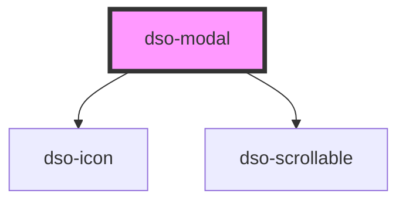

# dso-modal

**Let op: Core, React en Angular hebben ieder een eigen preferred method voor het gebruik van `<dso-modal>`.**

Modals werken het best wanneer deze op een hoog niveau in de DOM tree geplaatst worden. (bv als last child in `<body>`). Om dit te bewerkstelligen schrijven we voor elk framework een eigen manier van implementeren voor. Voor Core en Angular kan programmatisch de modal geopent worden. Bij React is een Higher-Order-Component beschikbaar die de modal op de juiste locatie in het DOM plaatst.

## Core `DsoModalController`

Voorbeeld:

```typescript
import { DsoModalController, ModalContent, ModalOptions } from "@dso-toolkit/core";

const controller = new DsoModalController();

const modal: ModalContent = {
  title: "Titel",
  body: "<span>content</span>",
};

const ref = controller.open(modal);

// Remove modal from DOM
ref.close();
```

### API

```typescript
export type AllowedModalContentTypes = HTMLElement | DocumentFragment | string;

interface ModalContent {
  title?: string;
  body: AllowedModalContentTypes;
  footer?: AllowedModalContentTypes;
}

interface ModalOptions {
  role?: "alert" | "dialog" | "alertdialog";
  showCloseButton?: boolean;
  initialFocus?: string;
}

class DsoModalController {
  open(modal: ModalContent, options?: ModalOptions): DsoModalRef
}

class DsoModalRef {
  /** Removes the Dialog **/
  close(): void;

  addEventListener(eventName: "dsoClose", fn: EventListenerOrEventListenerObject): void;

  removeEventListener(eventName: "dsoClose", fn: EventListenerOrEventListenerObject): void;
}
```

Deze `DsoModalRef` bevat de functie `close` om de modal te sluiten. via de functies `addEventListener` en `removeEventlistener` kan de afnemer aanhaken op het `dsoClose` event. `modalRef.addEventListener('dsoClose', () => modalRef.close())`

## React `<DsoModalPortal />`
Voor React is een higher order component (`<DsoModalPortal />`) beschikbaar om de `<DsoModal />` op de juiste plek in het DOM te plaatsen. Zie "Properties" onderaan deze pagina voor de API van `<DsoModal/>`

```tsx
<DsoModalPortal>
  <DsoModal {...modalProps}>
    <div slot="body">{body}</div>
    <div slot="footer">{footer}</div>
  </DsoModal>
</DsoModalPortal>
```

## Angular `DsoModalController`

Voorbeeld:

```typescript
import { DsoModalController, DsoModalRef, ModalContent, ModalOptions } from "@dso-toolkit/angular";

@Component()
export class ModalControllerDemo {
  private controller: DsoModalController = inject(DsoModalController);

  open() {
    const ref = this.modalController.open({
      title: 'DSO Angular Modal',
      body: ModalBodyComponent, // Angular Component. note: TemplateRef's are also allowed.
      footer: ModalFooterComponent, // Angular Component.
    },
    {
      data: {
        text: 'Dit object is beschikbaar via 'private data = inject(DIALOG_DATA)' binnen bijvoorbeeld ModalBodyComponent',
      },
    });

    ref.onDsoClose().subscribe(() => ref.close());
  }
}
```

### API

```typescript
export type AllowedModalContentTypes = Type<unknown> | TemplateRef<unknown>;

class DsoModalController {
  open(modal: ModalContent, options?: ModalOptions): DsoModalRef
}

interface ModalContent {
  title?: string;
  body: AllowedModalContentTypes;
  footer?: AllowedModalContentTypes;
}

interface ModalOptions {
  role?: "alert" | "dialog" | "alertdialog";
  showCloseButton?: boolean;
  initialFocus?: string;
}

class DsoModalRef {
  /** Removes the Dialog **/
  close(): void;

  onDsoClose(): EventEmitter<DsoModalCloseEvent>;
}
```

De `DsoModalRef` bevat de functie `close` om de modal te sluiten en een functie `onDsoClose` om naar het `dsoClose` event te luisteren. `modalRef.onDsoClose().subscribe(() => modalRef.close())`


<!-- Auto Generated Below -->


## Properties

| Property          | Attribute           | Description                                                                                                                                                                                                                         | Type                                                                                                 | Default     |
| ----------------- | ------------------- | ----------------------------------------------------------------------------------------------------------------------------------------------------------------------------------------------------------------------------------- | ---------------------------------------------------------------------------------------------------- | ----------- |
| `fullscreen`      | `fullscreen`        | when set the modal will be shown in fullscreen.                                                                                                                                                                                     | `boolean \| undefined`                                                                               | `undefined` |
| `initialFocus`    | `initial-focus`     | Selector used to query the element which will be focused when the component instantiated. When undefined the modal focuses the first button.dso-primary in the modal footer. If no button can be found the close button is focused. | `string \| undefined`                                                                                | `undefined` |
| `modalTitle`      | `modal-title`       | The title of the Modal.                                                                                                                                                                                                             | `string \| undefined`                                                                                | `undefined` |
| `returnFocus`     | --                  | Function that returns the element to focus on Modal close. Return `false` for no focus restore.                                                                                                                                     | `((nodeFocusedBeforeActivation: HTMLElement \| SVGElement) => FocusTargetValueOrFalse) \| undefined` | `undefined` |
| `role`            | `role`              | the role for the modal `dialog` \| `alert` \| `alertdialog`.                                                                                                                                                                        | `null \| string`                                                                                     | `"dialog"`  |
| `showCloseButton` | `show-close-button` | when `false` the close button in the header will not be rendered. Defaults to `true`.                                                                                                                                               | `boolean`                                                                                            | `true`      |


## Events

| Event      | Description                                     | Type                              |
| ---------- | ----------------------------------------------- | --------------------------------- |
| `dsoClose` | Emitted when the user wants to close the Modal. | `CustomEvent<DsoModalCloseEvent>` |


## Dependencies

### Depends on

- [dso-icon](../icon)
- [dso-scrollable](../scrollable)

### Graph


----------------------------------------------

*Built with [StencilJS](https://stenciljs.com/)*
