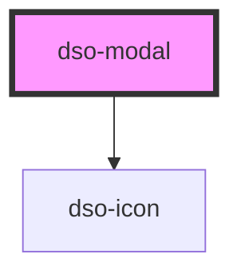

# dso-modal

<!-- Auto Generated Below -->

## Properties

| Property     | Attribute     | Description | Type                                                | Default     |
| ------------ | ------------- | ----------- | --------------------------------------------------- | ----------- |
| `hasFooter`  | `has-footer`  |             | `boolean \| undefined`                              | `undefined` |
| `modalTitle` | `modal-title` |             | `string \| undefined`                               | `undefined` |
| `role`       | `role`        |             | `"alert" \| "alertdialog" \| "dialog" \| undefined` | `undefined` |

## Events

| Event      | Description | Type                              |
| ---------- | ----------- | --------------------------------- |
| `dsoClose` |             | `CustomEvent<DsoModalCloseEvent>` |

## Dependencies

### Depends on

- [dso-icon](../icon)

### Graph

----------------------------------------------

*Built with [StencilJS](https://stenciljs.com/)*
