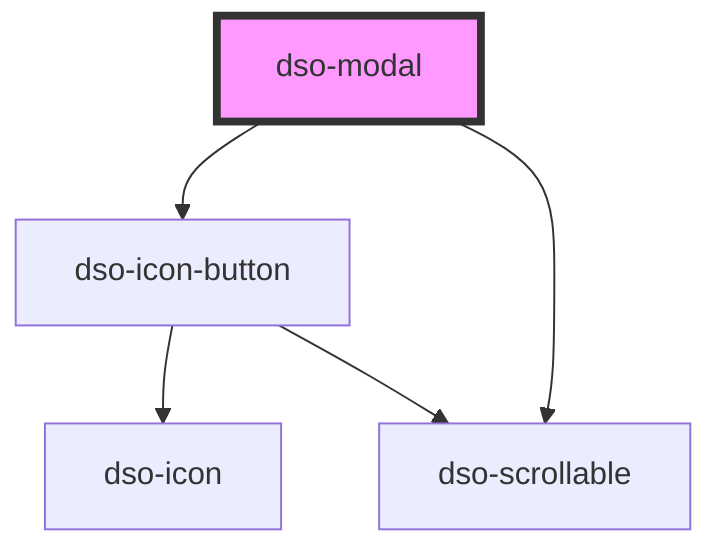

# `<dso-modal>`

Bij het instantieren van een `dso-modal` wordt op de body het scrollgedrag 'achter' de modal automatisch uitgezet dmv detectie middels CSS. Als afnemer kun je dus een modal starten door `<dso-modal>` pas te renderen als je een modal wil.

<!-- Auto Generated Below -->

## Properties

| Property      | Attribute      | Description                                                                                                                                                                                                                                                        | Type                                  | Default     |
| ------------- | -------------- | ------------------------------------------------------------------------------------------------------------------------------------------------------------------------------------------------------------------------------------------------------------------ | ------------------------------------- | ----------- |
| `closable`    | `closable`     | when `false` the close button in the header will not be rendered.  Needs `modalTitle` to be set.                                                                                                                                                                   | `boolean`                             | `false`     |
| `dialogRole`  | `dialog-role`  | the role for the modal `dialog` \| `alert` \| `alertdialog`.                                                                                                                                                                                                       | `null \| string`                      | `"dialog"`  |
| `fullscreen`  | `fullscreen`   | when set the modal will be shown in fullscreen.                                                                                                                                                                                                                    | `boolean \| undefined`                | `undefined` |
| `modalTitle`  | `modal-title`  | The title of the Modal.                                                                                                                                                                                                                                            | `string \| undefined`                 | `undefined` |
| `returnFocus` | `return-focus` | The element to return focus to after the modal is closed.  * `undefined` will return focus to the previously focused element (default). * `false` will not return focus to any element. * or, provide your own `HTMLElement` that will receive focus upon closing. | `HTMLElement \| boolean \| undefined` | `undefined` |

## Events

| Event      | Description                                                                                                                      | Type                           |
| ---------- | -------------------------------------------------------------------------------------------------------------------------------- | ------------------------------ |
| `dsoClose` | Emitted when the user: - clicks the close button - dismisses the Modal with the Escape button - clicks or taps outside the Modal | `CustomEvent<ModalCloseEvent>` |

## Dependencies

### Depends on

- [dso-icon-button](../icon-button)
- [dso-scrollable](../scrollable)

### Graph

----------------------------------------------

*Built with [StencilJS](https://stenciljs.com/)*
