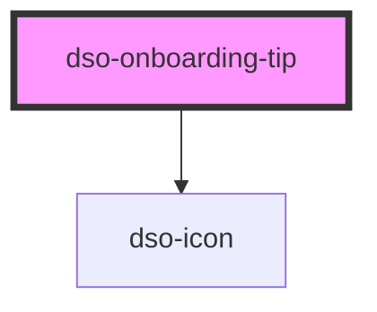

# `<dso-onboarding-tip>`

Een Onboarding Tip hoort bij een `reference` element. Dit dient aangegeven worden met het attribuut `id`. Het 
reference element dient een `aria-describedby` attribuut te hebben met dezelfde waarde.

De Onboarding Tip kan met het attribuut `active` getoond worden.

Het positioneren van de onboarding-tip wordt met [Floating-UI](https://floating-ui.com/) gedaan.

<!-- Auto Generated Below -->

## Properties

| Property    | Attribute   | Description                                                          | Type                                     | Default   |
| ----------- | ----------- | -------------------------------------------------------------------- | ---------------------------------------- | --------- |
| `placement` | `placement` | Where to place the Onboarding Tip relative to its reference element. | `"bottom" \| "left" \| "right" \| "top"` | `"right"` |

## Events

| Event      | Description                                      | Type                                   |
| ---------- | ------------------------------------------------ | -------------------------------------- |
| `dsoClose` | Emitted when the user closes the Onboarding Tip. | `CustomEvent<OnboardingTipCloseEvent>` |

## Dependencies

### Depends on

- [dso-icon](../icon)

### Graph

----------------------------------------------

*Built with [StencilJS](https://stenciljs.com/)*
