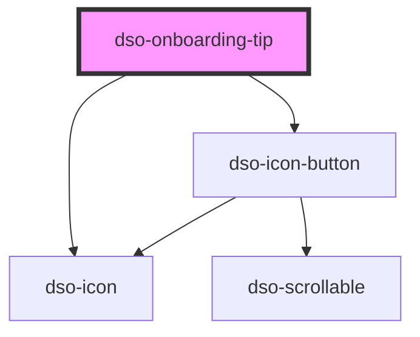

# `<dso-onboarding-tip>`

De `<dso-onboarding-tip>` is bedoeld om extra uitleg of hulp te geven bij een specifiek element op de pagina, het zogenaamde referentie-element.

### Koppeling met een referentie-element
Om een Onboarding Tip correct te koppelen:
- Geef het referentie-element een uniek id.
- Verwijs vanuit het referentie-element naar de tip via `aria-describedby`, met als waarde het id van de `<dso-onboarding-tip>`.

Zorg ervoor dat de tip in het DOM zo dicht mogelijk bij het referentie-element staat.

### Zichtbaarheid en toegankelijkheid
- Wanneer de Onboarding Tip verdwijnt (bijvoorbeeld doordat hij uit het DOM wordt verwijderd), moet ook de verwijzing via `aria-describedby` van het referentie-element worden verwijderd.

### Positionering
De positionering van de tip gebeurt automatisch met behulp van [Floating-UI](https://floating-ui.com/), zodat deze altijd op de juiste plek verschijnt ten opzichte van het referentie-element.

### Top Layer
De onboarding tip wordt in de top layer geplaatst. Dit betekent dat hij altijd boven andere elementen in hetzelfde document zichtbaar is.

<!-- Auto Generated Below -->

## Properties

| Property    | Attribute   | Description                                                          | Type                                     | Default   |
| ----------- | ----------- | -------------------------------------------------------------------- | ---------------------------------------- | --------- |
| `placement` | `placement` | Where to place the Onboarding Tip relative to its reference element. | `"bottom" \| "left" \| "right" \| "top"` | `"right"` |

## Events

| Event      | Description                                      | Type                                   |
| ---------- | ------------------------------------------------ | -------------------------------------- |
| `dsoClose` | Emitted when the user closes the Onboarding Tip. | `CustomEvent<OnboardingTipCloseEvent>` |

## Dependencies

### Depends on

- [dso-icon](../icon)
- [dso-icon-button](../icon-button)

### Graph

----------------------------------------------

*Built with [StencilJS](https://stenciljs.com/)*
