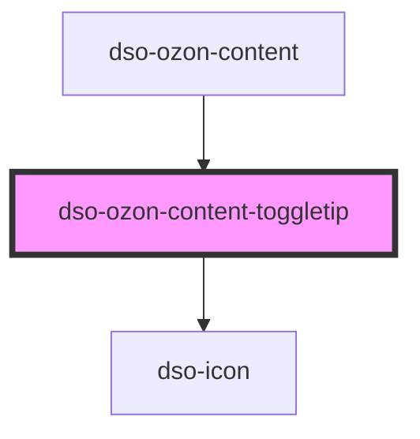

# <dso-ozon-content-toggletip>

<!-- Auto Generated Below -->

## Properties

| Property | Attribute | Description                          | Type                     | Default     |
| -------- | --------- | ------------------------------------ | ------------------------ | ----------- |
| `icon`   | `icon`    | The alias of the icon in the button. | `IconAlias \| undefined` | `undefined` |

## Dependencies

### Used by

 - [dso-ozon-content](../..)

### Depends on

- [dso-icon](../../../icon)

### Graph

----------------------------------------------

*Built with [StencilJS](https://stenciljs.com/)*
