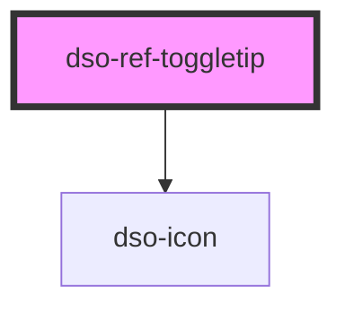

# dso-begrip

<!-- Auto Generated Below -->

## Properties

| Property            | Attribute | Description                          | Type                  | Default     |
| ------------------- | --------- | ------------------------------------ | --------------------- | ----------- |
| `icon` _(required)_ | `icon`    | The alias of the icon in the button. | `string \| undefined` | `undefined` |

## Dependencies

### Depends on

- [dso-icon](../../icon)

### Graph

----------------------------------------------

*Built with [StencilJS](https://stenciljs.com/)*
