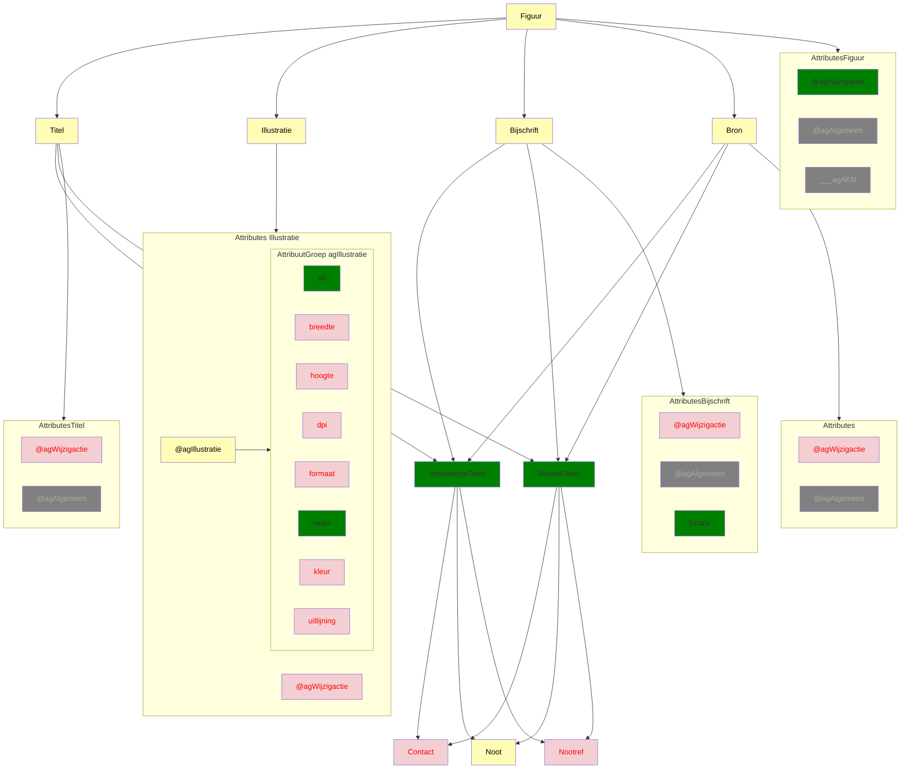

# Ozon dekkingsgraad
## `<Figuur>`
Bron: [1.4.0](https://koop.gitlab.io/STOP/voorinzage/standaard-preview-b/tekst_xsd_Element_tekst_InlineTekstAfbeelding.html)
(Namespace: tekst)



`Titel`: slecht de textcontent:
```tsx
const titel = childNodes.find((n) => getNodeName(n) === "Titel")?.textContent;
```
`Titel` is een complex type en kan weer verschillende andere elementen bevatten, welke we nog niet verwerken.

Slecht de wijzigactie op Figuur dekken we. De wijgactie op Titel, Illustratie, Bijschrift en Bron negeren we momenteel. 
