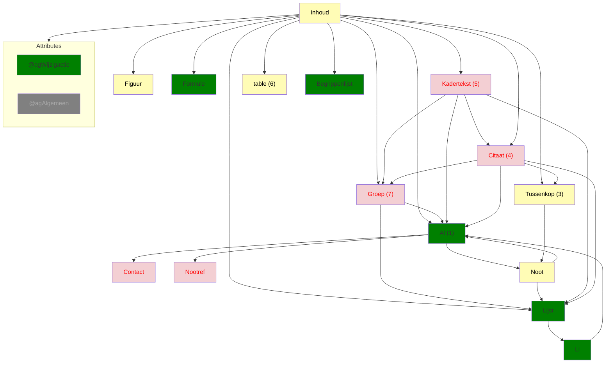
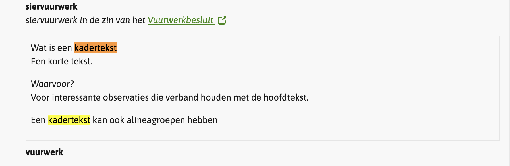

# Ozon dekkingsgraad
## `<Inhoud>`
Bron: [1.4.0](https://koop.gitlab.io/STOP/voorinzage/standaard-preview-b/tekst_xsd_Element_tekst_Inhoud.html)
(Namespace: tekst)



(1) Met uitzondering van `Contact`. Diverse Stop elementen kunnen `Contact` bevatten. Bieden we nog geen
ondersteuning voor.

(3) Het element <tekst:Tussenkop> is een niet-hiërarchische kop die geplaatst kan worden binnen lopende tekst.

`Tussenkop` renderen we met `font-style: italic;`. `Tussenkop` is een complex type en kan o.a. Noot bevatten.
Omdat `Tussenkop` via de fallback wordt verwerkt, worden de elementen die het bevat wel 
verwerkt, maar zal dit leiden tot invalide HTML ivm het renderen van o.a. een `p` binnen een `span`

(4) `Citaat` kan bijv. een `Al` bevatten en dan renderen we vanuit de fallback als een `<p>` in een `<span>`. En dat
is geen valide HTML.

(5) Het element <tekst:Kadertekst> bevat een kort stuk tekst, dat buiten de verhalende stroom van de hoofdtekst moet worden gepresenteerd.

`Kadertekst`: `ozon-content.tsx` plaatst via `fallback.node.tsx` een class `od-Kadertekst`
```scss
.od-Kadertekst {
  border: 1px solid #e5e5e5;
  margin-block-end: units.$u1;
  padding: units.$u1;
}
```
Wat in de volgende presentatie resulteert:


Terwijl `Kadertekst` een complex type is volgens de STOP standaard 1.4.0 (en ook al 1.3.0), maar doen we niks mee.
Een `Kadertekst` kan bijv. een `Al` bevatten en dan renderen we vanuit de fallback een `<p>` in een `<span>`. En dat
is geen valide HTML.

(6) `tgroup`, `thead`, `tbody`, `row` en `entry` kan een `wijzigactie` `voegtoe` of `verwijder` hebben. Daar is nog 
geen ondersteuning voor.

(7)
Het element <tekst:Groep> is een container voor bij elkaar horende elementen in een tekst.
In de weergave zal hier geen tussenliggende witregel worden toegevoegd.

Al --> Noot --> Al
Al --> Noot --> Lijst --> Li --> Al

## agWijzigactieStructuur
Hoe moet deze geïnterpreteerd worden in relatie tot dit onderzoek? Het enige element dat vanuit dit onderzoek deze 
attribuutgroep kan hebben is `Groep` dat aanwezig kan zijn in `Inhoud`, `Citaat`, `Kadertekst` en `entry` (cel 
binnen een tabel).
