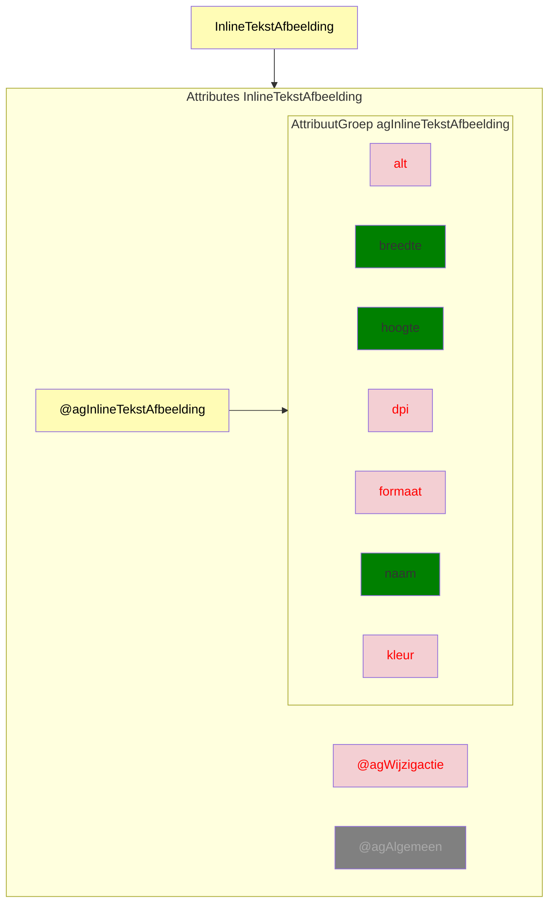

# Ozon dekkingsgraad
## `<InlineTekstAfbeelding>`
Bron: [1.4.0](https://koop.gitlab.io/STOP/voorinzage/standaard-preview-b/tekst_xsd_Element_tekst_InlineTekstAfbeelding.html)
(Namespace: tekst)

```mermaid
graph TB;
    InlineTekstAfbeelding:::partial --> AttributesInlineTekstAfbeelding
    
    subgraph AttributesInlineTekstAfbeelding["Attributes InlineTekstAfbeelding"]
        agWijzigactieITA["@agWijzigactie"]:::unsupported
        agAlgemeenITA["@agAlgemeen"]:::nvt
        agInlineTekstAfbeelding["@agInlineTekstAfbeelding"]:::partial --> AttribuutGroepAgInlineTekstAfbeelding
    end
    subgraph AttribuutGroepAgInlineTekstAfbeelding["AttribuutGroep agInlineTekstAfbeelding"]
        alt:::unsupported;
        breedte:::supported;
        hoogte:::supported;
        dpi:::unsupported;
        formaat:::unsupported;
        naam:::supported;
        kleur:::unsupported;
    end

    classDef unsupported fill:#f3cfd3,color:red
    classDef supported fill:green
    classDef partial fill:#fffcb6,color:black
    classDef nvt fill:grey,color:darkgrey
```
