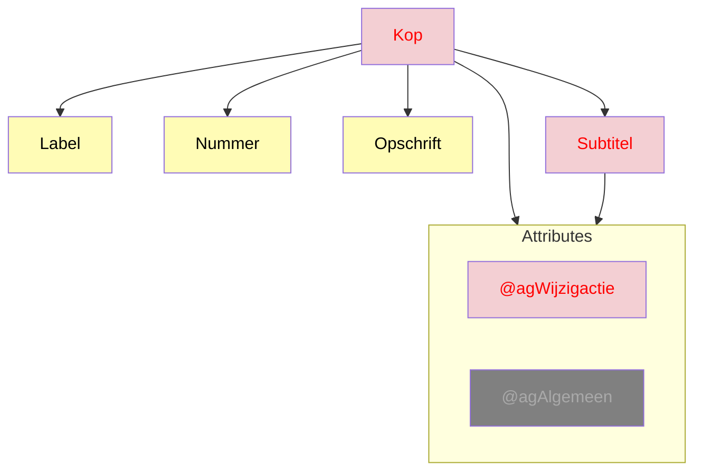

# Ozon dekkingsgraad
## `<Kop>`
Bron: [1.4.0](https://koop.gitlab.io/STOP/voorinzage/standaard-preview-b/tekst_xsd_Element_tekst_Kop.html)
(Namespace: tekst)

`Kop` en `Subtitel` worden binnen `ozon-content` verwerkt door `fallback.node.tsx` en daarom ondersteunen we het 
attribuut `wijzigactie=voegtoe|verwijder` niet. 
