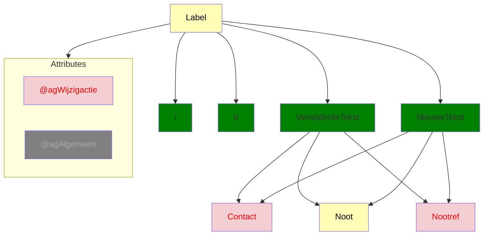

# Ozon dekkingsgraad
## `<Label>`
Bron: [1.4.0](https://koop.gitlab.io/STOP/voorinzage/standaard-preview-b/tekst_xsd_Element_tekst_Label.html)
(Namespace: tekst)

`Label` wordt binnen `ozon-content` verwerkt door `fallback.node.tsx` en daarom ondersteunen we het 
attribuut `wijzigactie=voegtoe|verwijder` niet. Wel support voor `VerwijderdeTekst` en `NieuweTekst`.
`VerwijderdeTekst` en `NieuweTekst` kunnen o.a. `Contact`, `Nootref` en `Noot` bevatten.

Vraag: Welke situatie wordt er gedekt met `wijzigactie=voegtoe` en `wijzigactie=verwijder`?
