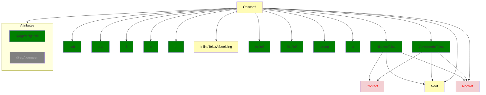

# Ozon dekkingsgraad
## `<Opschrift>`
Bron: [1.4.0](https://koop.gitlab.io/STOP/voorinzage/standaard-preview-b/tekst_xsd_Element_tekst_Opschrift.html)
(Namespace: tekst)

```mermaid
graph TB;
    Opschrift:::partial --> sub:::supported
    Opschrift --> sup:::supported
    Opschrift --> i:::supported
    Opschrift --> b:::supported
    Opschrift --> br:::supported
    Opschrift --> InlineTekstAfbeelding:::partial
    Opschrift --> IntRef:::supported
    Opschrift --> ExtRef:::supported
    Opschrift --> strong:::supported
    Opschrift --> u:::supported
    Opschrift --> VerwijderdeTekst:::supported
    Opschrift --> NieuweTekst:::supported
    Opschrift --> Nootref:::unsupported
    Opschrift --> Noot:::partial
    Opschrift --> Attributes
    VerwijderdeTekst --> Contact:::unsupported
    VerwijderdeTekst --> Noot:::partial
    VerwijderdeTekst --> Nootref:::unsupported
    NieuweTekst --> Contact:::unsupported
    NieuweTekst --> Noot:::partial
    NieuweTekst --> Nootref:::unsupported
    subgraph Attributes
        agWijzigactie["@agWijzigactie"]:::supported
        agAlgemeen["@agAlgemeen"]:::nvt
    end
    
    classDef unsupported fill:#f3cfd3,color:red
    classDef supported fill:green
    classDef partial fill:#fffcb6,color:black
    classDef nvt fill:grey,color:darkgrey
```
