`<Label>` | `<Nummer>` | `<Opschrift>`

Bron: [1.4.0-ic](https://koop.gitlab.io/stop/standaard/1.4.0-ic/tekst_xsd_Element_tekst_Label.html)

(Namespace: tekst)

```mermaid
graph LR;
    Label-->i;
    Label-->b;

    Label-->VerwijderdeTekst;
    Label-->NieuweTekst;

    Label-->agWijzigactie;
    Label-->agAlgemeen;

    Nummer-->i;
    Nummer-->b;

    Nummer-->VerwijderdeTekst;
    Nummer-->NieuweTekst;

    Nummer-->agWijzigactie;
    Nummer-->agAlgemeen;
    
    Opschrift-->sub:::supported;
    Opschrift-->sup:::supported;

    Opschrift-->Nootref;
    Opschrift-->Noot;

    Opschrift-->VerwijderdeTekst;
    Opschrift-->NieuweTekst;

    Opschrift-->i;
    Opschrift-->b;
    Opschrift-->br:::supported;
    Opschrift-->InlineTekstAfbeelding;
    Opschrift-->IntRef;
    Opschrift-->ExtRef;
    Opschrift-->strong;
    Opschrift-->u;
    
    Opschrift-->agWijzigactie;
    Opschrift-->agAlgemeen;

    i:::supported-->b;
    i-->u;
    i-->strong;

    i-->sub;
    i-->sup;

    i-->Nootref;
    i-->Noot;

    i-->VerwijderdeTekst;
    i-->NieuweTekst;

    i-->ExtRef;
    i-->IntRef;
    i-->ExtIoRef;
    i-->IntIoRef;
    i-->Contact;

    i-->br;
    i-->InlineTekstAfbeelding;
    
    b:::supported-->i;
    b-->u;
    b-->strong;

    b-->sub;
    b-->sup;

    b-->Nootref;
    b-->Noot;

    b-->VerwijderdeTekst;
    b-->NieuweTekst;

    b-->ExtRef;
    b-->IntRef;
    b-->IntIoRef;
    b-->ExtIoRef;
    b-->Contact;

    b-->br;
    b-->InlineTekstAfbeelding;

    VerwijderdeTekst-->i;
    VerwijderdeTekst-->b;
    VerwijderdeTekst-->u;
    VerwijderdeTekst-->strong;
    VerwijderdeTekst-->br;
    VerwijderdeTekst-->InlineTekstAfbeelding;

    VerwijderdeTekst-->sub;
    VerwijderdeTekst-->sup;

    VerwijderdeTekst-->Nootref;
    VerwijderdeTekst-->Noot;

    VerwijderdeTekst-->ExtRef;
    VerwijderdeTekst-->IntRef;
    VerwijderdeTekst-->IntIoRef;
    VerwijderdeTekst-->ExtIoRef;
    VerwijderdeTekst-->Contact;

    NieuweTekst-->i;
    NieuweTekst-->b;
    NieuweTekst-->u;
    NieuweTekst-->strong;
    NieuweTekst-->br;
    NieuweTekst-->InlineTekstAfbeelding;

    NieuweTekst-->sub;
    NieuweTekst-->sup;

    NieuweTekst-->Nootref;
    NieuweTekst-->Noot;

    NieuweTekst-->ExtRef;
    NieuweTekst-->IntRef;
    NieuweTekst-->IntIoRef;
    NieuweTekst-->ExtIoRef;
    NieuweTekst-->Contact;

    agWijzigactieValues["verwijder | voegtoe | verplaatst"];
    agWijzigactie-->agWijzigactieValues

    u:::supported-->b;
    u-->i;
    u-->strong;

    u-->sub;
    u-->sup;

    u-->Nootref;
    u-->Noot;

    u-->VerwijderdeTekst;
    u-->NieuweTekst;

    u-->ExtRef;
    u-->IntRef;
    u-->IntIoRef;
    u-->ExtIoRef;
    u-->Contact;

    u-->br;
    u-->InlineTekstAfbeelding;

    strong:::supported-->b;
    strong-->u;
    strong-->i;

    strong-->sub;
    strong-->sup;

    strong-->Nootref;
    strong-->Noot;

    strong-->VerwijderdeTekst;
    strong-->NieuweTekst;

    strong-->ExtRef;
    strong-->IntRef;
    strong-->IntIoRef;
    strong-->ExtIoRef;
    strong-->Contact;

    strong-->br;
    strong-->InlineTekstAfbeelding;

    Nootref-->refid;
    Nootref-->agWijzigactie;
    Nootref-->agAlgemeen;

    Noot-->id;
    Noot-->typeNoot["type"];
    Noot-->agWijzigactie;
    Noot-->NootNummer;
    Noot-->Al;
    Noot-->Lijst;

    typeNootValues["voet | tabel"];
    typeNoot-->typeNootValues;

    Lijst-->Lijstaanhef;
    Lijst-->Li;
    Lijst-->Lijstsluiting;
    Lijst-->typeLijst["type"];
    Lijst-->agAKN
    Lijst-->agWijzigactie;
    Lijst-->agAlgemeen;
    
    typeLijstValues["expliciet | ongemarkeerd"];
    typeLijst-->typeLijstValues;

    Lijstaanhef-->agWijzigactie;
    Lijstaanhef-->agAlgemeen;
    Lijstaanhef-->i;
    Lijstaanhef-->b;
    Lijstaanhef-->u;
    Lijstaanhef-->strong;
    Lijstaanhef-->br;
    Lijstaanhef-->InlineTekstAfbeelding;
    Lijstaanhef-->sub;
    Lijstaanhef-->sup;
    Lijstaanhef-->Nootref;
    Lijstaanhef-->Noot;
    Lijstaanhef-->VerwijderdeTekst;
    Lijstaanhef-->NieuweTekst;
    Lijstaanhef-->ExtRef;
    Lijstaanhef-->IntRef;
    Lijstaanhef-->IntIoRef;
    Lijstaanhef-->ExtIoRef;
    Lijstaanhef-->Contact;

    Li-->agAKN
    Li-->agWijzigactie;
    Li-->agAlgemeen;

    Li-->LiNummer;

    Li-->Al;
    Li-->Figuur;
    Li-->Formule;
    Li-->Lijst;
    Li-->table;

    Lijstsluiting-->agWijzigactie;
    Lijstsluiting-->agAlgemeen;
    Lijstsluiting-->i;
    Lijstsluiting-->b;
    Lijstsluiting-->u;
    Lijstsluiting-->strong;
    Lijstsluiting-->br;
    Lijstsluiting-->InlineTekstAfbeelding;

    Lijstsluiting-->sub;
    Lijstsluiting-->sup;

    Lijstsluiting-->Nootref;
    Lijstsluiting-->Noot;

    Lijstsluiting-->VerwijderdeTekst;
    Lijstsluiting-->NieuweTekst;

    Lijstsluiting-->ExtRef;
    Lijstsluiting-->IntRef;
    Lijstsluiting-->IntIoRef;
    Lijstsluiting-->ExtIoRef;
    Lijstsluiting-->Contact;

    LiNummer-->agWijzigactie;
    LiNummer-->agAlgemeen;

    LiNummer-->VerwijderdeTekst;
    LiNummer-->NieuweTekst;
    LiNummer-->sub;
    LiNummer-->sup;

    Figuur-->agAKN
    Figuur-->agWijzigactie;
    Figuur-->agAlgemeen;

    Figuur-->Titel;
    Figuur-->Illustratie;
    Figuur-->Bijschrift;
    Figuur-->Bron;

   
    Titel-->agWijzigactie;
    Titel-->agAlgemeen;
    Titel-->sub;
    Titel-->sup;
    Titel-->Nootref;
    Titel-->Noot;
    Titel-->VerwijderdeTekst;
    Titel-->NieuweTekst;
    Titel-->i;
    Titel-->b;
    Titel-->br;
    Titel-->InlineTekstAfbeelding;
    Titel-->IntRef;
    Titel-->ExtRef;
    Titel-->strong;
    Titel-->u;
    
    Illustratie-->agIllustratie;
    Illustratie-->agAlgemeen;

    Bijschrijft-->locatie;
    Bijschrijft-->agWijzigactie;
    Bijschrijft-->agAlgemeen;
    Bijschrijft-->i;
    Bijschrijft-->b;
    Bijschrijft-->u;
    Bijschrijft-->strong;
    Bijschrijft-->br;
    Bijschrijft-->InlineTekstAfbeelding;

    Bijschrijft-->sub;
    Bijschrijft-->sup;

    Bijschrijft-->Nootref;
    Bijschrijft-->Noot;

    Bijschrijft-->VerwijderdeTekst;
    Bijschrijft-->NieuweTekst;

    Bijschrijft-->ExtRef;
    Bijschrijft-->IntRef;
    Bijschrijft-->IntIoRef;
    Bijschrijft-->Contact;

    locatieValues["boven | onder"];
    locatie-->locatieValues;

    Bron-->agAlgemeen;
    Bron-->agWijzigactie;
    Bron-->i;
    Bron-->b;
    Bron-->u;
    Bron-->strong;
    Bron-->br;
    Bron-->InlineTekstAfbeelding;

    Bron-->sub;
    Bron-->sup;

    Bron-->Nootref;
    Bron-->Noot;

    Bron-->VerwijderdeTekst;
    Bron-->NieuweTekst;

    Bron-->ExtRef;
    Bron-->IntRef;
    Bron-->IntIoRef;
    Bron-->Contact;

    Formule-->agAKN;
    Formule-->agWijzigactie;
    Formule-->agAlgemeen;

    Formule-->Illustratie;
    Formule-->Bijschrift;
    Formule-->Bron;

    ExtRef-->agExtrefRefSoort;
    ExtRef-->agDoelReferentie;
    ExtRef-->agAlgemeen;
    ExtRef-->scope;
    
    ExtRef-->sub;
    ExtRef-->sup;

    ExtRef-->i;
    ExtRef-->b;
    ExtRef-->InlineTekstAfbeelding;

    ExtRef-->VerwijderdeTekst;
    ExtRef-->NieuweTekst;

    IntRef-->agDoelReferentie;
    IntRef-->agAlgemeen;
    IntRef-->scope;
    
    IntRef-->sub;
    IntRef-->sup;

    IntRef-->i;
    IntRef-->b;
    IntRef-->InlineTekstAfbeelding;

    IntRef-->VerwijderdeTekst;
    IntRef-->NieuweTekst;

    IntIoRef-->agAlgemeen;
    IntIoRef-->agAKN;
    IntIoRef-->agDoelReferentie;

    IntIoRef-->sub;
    IntIoRef-->sup;

    IntIoRef-->i;
    IntIoRef-->b;
    IntIoRef-->InlineTekstAfbeelding;

    IntIoRef-->VerwijderdeTekst;
    IntIoRef-->NieuweTekst;

    ExtIoRef-->agAKN;
    ExtIoRef-->agDoelReferentie;
    ExtIoRef-->agAlgemeen;

    InlineTekstAfbeelding:::partial-->agInlineTekstAfbeelding;
    InlineTekstAfbeelding-->agWijzigactie;
    InlineTekstAfbeelding-->agAlgemeen;

    Contact:::unsupported-->agContactgegevens:::unsupported;

    agInlineTekstAfbeelding-->alt:::unsupported;
    agInlineTekstAfbeelding-->breedte:::supported;
    agInlineTekstAfbeelding-->hoogte:::supported;
    agInlineTekstAfbeelding-->dpi:::unsupported;
    agInlineTekstAfbeelding--> formaat:::unsupported;
    agInlineTekstAfbeelding--> naam:::supported;
    agInlineTekstAfbeelding--> kleur:::unsupported;

    classDef unsupported fill:#f3cfd3,color:red
    classDef supported fill:#def2c5,color:black
    classDef partial fill:#fffcb6,color:black
```

Work in progress
Todo:
- `<Inhoud>` in de Mermaid graph er bij zetten
- visualiseren dekkinggraad incl. beschijving/specificatie van ontbrekende functionaliteit
