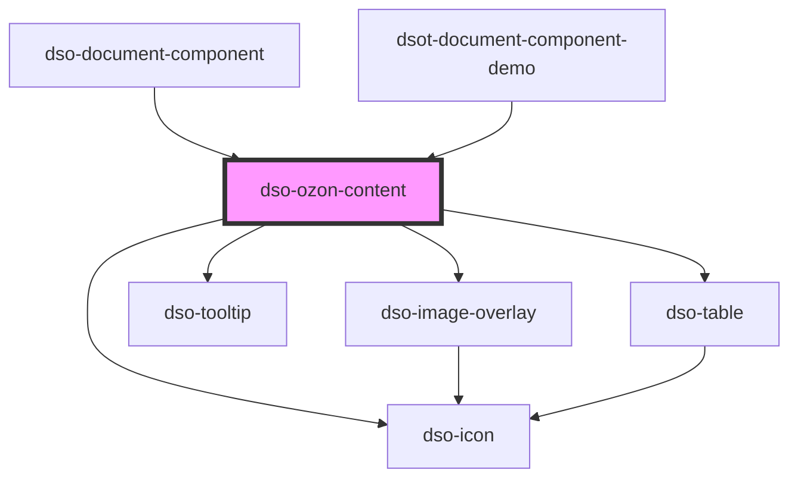

# `<dso-ozon-content>`

Het Ozon Content component verwerkt XML die uit de Ozon API komt.

<!-- Auto Generated dso-toolkit -->

## Types

### OzonContentAnchorClickEvent

```typescript
export interface OzonContentAnchorClickEvent {
  /** Node type, eg: `IntRef` or `IntIoRef` */
  node: string;
  href: string;
  documentComponent: string;
  originalEvent: MouseEvent;
}
```

<!-- src/components/ozon-content/ozon-content.interfaces.ts::OzonContentAnchorClickEvent -->

### OzonContentClickEvent

```typescript
interface OzonContentClickBaseEvent<T extends string> {
  type: T;
  node: Element;
  originalEvent: MouseEvent;
}
```

<!-- src/components/ozon-content/ozon-content.interfaces.ts::OzonContentClickEvent -->

### OzonContentInputType

```typescript
export type OzonContentInputType = XMLDocument | string;
```

<!-- src/components/ozon-content/ozon-content.interfaces.ts::OzonContentInputType -->

### OzonContentMarkFunction

```typescript
(text: string) => OzonContentText[] | undefined
```

<!-- src/components/ozon-content/ozon-content.interfaces.ts::OzonContentMarkFunction -->

### OzonContentMarkItemHighlightEvent

```typescript
export interface OzonContentMarkItemHighlightEvent {
  text: string;
  elementRef: HTMLElement;
}
```

<!-- src/components/ozon-content/ozon-content.interfaces.ts::OzonContentMarkItemHighlightEvent -->

### OzonContentUrlResolver

```typescript
export interface OzonContentUrlResolver {
  (name: "Illustratie" | "InlineTekstAfbeelding", attribute: "naam", value: string | null, element: Element): string;
  (name: "ExtIoRef" | "ExtRef", attribute: "ref", value: string | null, element: Element): string;
}
```

<!-- src/components/ozon-content/ozon-content.interfaces.ts::OzonContentUrlResolver -->

<!-- Auto Generated Below -->

## Properties

| Property      | Attribute      | Description                                                                                                     | Type                                                              | Default     |
| ------------- | -------------- | --------------------------------------------------------------------------------------------------------------- | ----------------------------------------------------------------- | ----------- |
| `content`     | `content`      | The XML to be rendered.                                                                                         | `XMLDocument \| string \| undefined`                              | `undefined` |
| `inline`      | `inline`       | Setting this property creates dso-ozon-content as inline element instead of a block element.                    | `boolean`                                                         | `false`     |
| `mark`        | `mark`         | To mark text.                                                                                                   | `((text: string) => OzonContentText[] \| undefined) \| undefined` | `undefined` |
| `urlResolver` | `url-resolver` | A UrlResolver that will be called for all STOP elements that render to HTML5 elements with external references. | `OzonContentUrlResolver \| undefined`                             | `undefined` |

## Events

| Event                             | Description                                                                         | Type                                             |
| --------------------------------- | ----------------------------------------------------------------------------------- | ------------------------------------------------ |
| `dsoAnchorClick`                  | Emitted when `<a>` that is created through <IntIoRef> or <IntRef> is clicked.       | `CustomEvent<OzonContentAnchorClickEvent>`       |
| `dsoClick`                        | Emitted when an interactive element is clicked, except for <IntIoRef> and <IntRef>. | `CustomEvent<OzonContentClickBaseEvent<"Kop">>`  |
| `dsoOzonContentMarkItemHighlight` | Emitted when a marked item is highlighted.                                          | `CustomEvent<OzonContentMarkItemHighlightEvent>` |

## Dependencies

### Used by

- [dso-document-component](../document-component)
- [dsot-document-component-demo](../document-component-demo)

### Depends on

- [dso-icon](../icon)
- [dso-image-overlay](../image-overlay)
- [dso-tooltip](../tooltip)
- [dso-table](../table)

### Graph



---

_Built with [StencilJS](https://stenciljs.com/)_
