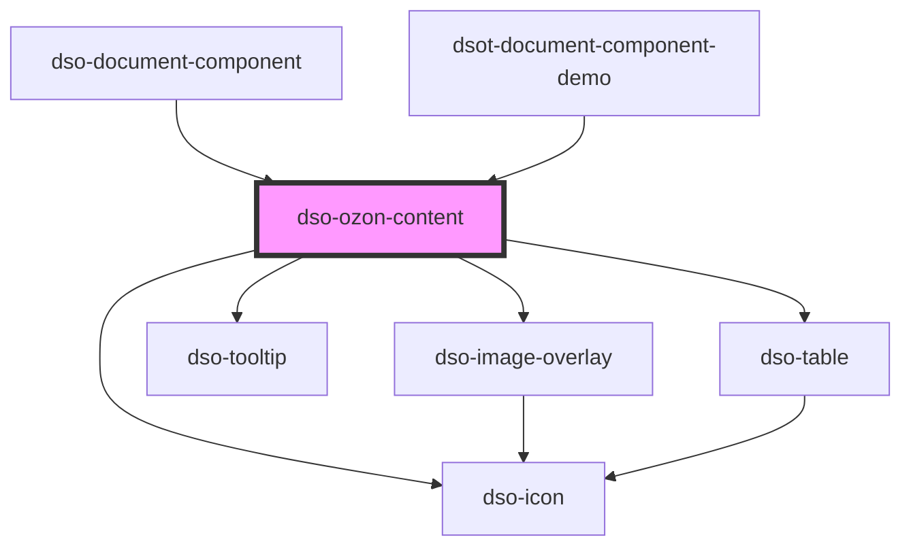

# `<dso-ozon-content>`

Het Ozon Content component verwerkt XML die uit de Ozon API komt.

<!-- Auto Generated Below -->

## Properties

| Property             | Attribute               | Description                                                                                  | Type                                                              | Default     |
| -------------------- | ----------------------- | -------------------------------------------------------------------------------------------- | ----------------------------------------------------------------- | ----------- |
| `addSpaceBeforeNode` | `add-space-before-node` | Adds a non breaking space to the node element.                                               | `boolean`                                                         | `false`     |
| `content`            | `content`               | The XML to be rendered.                                                                      | `XMLDocument \| string \| undefined`                              | `undefined` |
| `inline`             | `inline`                | Setting this property creates dso-ozon-content as inline element instead of a block element. | `boolean`                                                         | `false`     |
| `mark`               | --                      | To mark text.                                                                                | `((text: string) => OzonContentText[] \| undefined) \| undefined` | `undefined` |

## Events

| Event                             | Description                                | Type                                             |
| --------------------------------- | ------------------------------------------ | ------------------------------------------------ |
| `dsoAnchorClick`                  | Emitted when `<a>` is clicked.             | `CustomEvent<OzonContentAnchorClickEvent>`       |
| `dsoOzonContentMarkItemHighlight` | Emitted when a marked item is highlighted. | `CustomEvent<OzonContentMarkItemHighlightEvent>` |

## Dependencies

### Used by

 - [dso-document-component](../document-component)
 - [dsot-document-component-demo](../document-component-demo)

### Depends on

- [dso-icon](../icon)
- [dso-image-overlay](../image-overlay)
- [dso-tooltip](../tooltip)
- [dso-table](../table)

### Graph

----------------------------------------------

*Built with [StencilJS](https://stenciljs.com/)*
