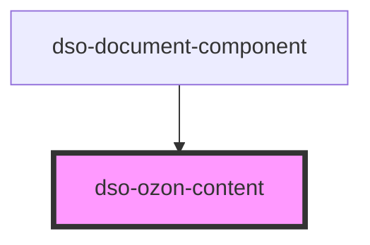

# `<dso-ozon-content>`

Het Ozon Content component verwerkt XML die uit de Ozon API komt.

## Custom Event interfaces

```typescript
export interface OzonContentAnchorClickEvent {
  node: string;
  href: string;
  documentComponent: string;
  originalEvent: MouseEvent;
}
```

<!-- Auto Generated Below -->


## Properties

| Property  | Attribute | Description                                                                                  | Type                  | Default     |
| --------- | --------- | -------------------------------------------------------------------------------------------- | --------------------- | ----------- |
| `content` | `content` | The XML to be rendered.                                                                      | `string \| undefined` | `undefined` |
| `inline`  | `inline`  | Setting this property creates dso-ozon-content as inline element instead of a block element. | `boolean`             | `false`     |


## Events

| Event            | Description                    | Type                                       |
| ---------------- | ------------------------------ | ------------------------------------------ |
| `dsoAnchorClick` | Emitted when `<a>` is clicked. | `CustomEvent<OzonContentAnchorClickEvent>` |


## Dependencies

### Used by

 - [dso-document-component](../document-component)

### Graph


----------------------------------------------

*Built with [StencilJS](https://stenciljs.com/)*
