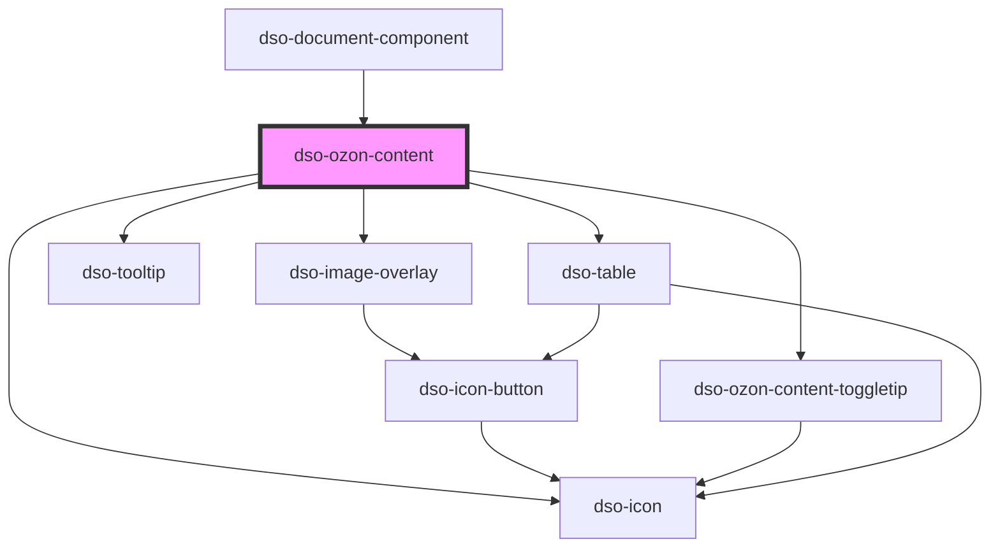

# `<dso-ozon-content>`

Het Ozon Content component verwerkt XML die uit de Ozon API komt.

<!-- Auto Generated Below -->

## Properties

| Property         | Attribute   | Description                                                                                                                                                                                               | Type                                                           | Default     |
| ---------------- | ----------- | --------------------------------------------------------------------------------------------------------------------------------------------------------------------------------------------------------- | -------------------------------------------------------------- | ----------- |
| `annotated`      | `annotated` | Boolean indicating that this dso-ozon-content is part of an annotated context. If true the content of the toggletip for "IntIoRef" will show a "Kenmerken en kaart" annotation button.                    | `boolean`                                                      | `false`     |
| `begripResolver` | --          | A BegripResolver that will be called for STOP element "IntRef". If the ref-attribute of IntRef points to a Begrip it should return the `<Definitie>` of that Begrip otherwise it should return undefined. | `OzonContentBegripResolver \| undefined`                       | `undefined` |
| `content`        | `content`   | The XML to be rendered.                                                                                                                                                                                   | `XMLDocument \| string \| undefined`                           | `undefined` |
| `inline`         | `inline`    | Setting this property creates dso-ozon-content as inline element instead of a block element.                                                                                                              | `boolean`                                                      | `false`     |
| `mark`           | --          | To mark text.                                                                                                                                                                                             | `((text: string) => MarkTextText[] \| undefined) \| undefined` | `undefined` |
| `urlResolver`    | --          | A UrlResolver that will be called for all STOP elements that render to HTML5 elements with external references.                                                                                           | `OzonContentUrlResolver \| undefined`                          | `undefined` |

## Events

| Event                             | Description                                     | Type                                                                                                                                                            |
| --------------------------------- | ----------------------------------------------- | --------------------------------------------------------------------------------------------------------------------------------------------------------------- |
| `dsoClick`                        | Emitted when an interactive element is clicked. | `CustomEvent<OzonContentClickBaseEvent<"IntIoRef"> \| OzonContentClickBaseEvent<"IntRef"> & { isModifiedEvent: boolean; } \| OzonContentClickBaseEvent<"Kop">>` |
| `dsoOzonContentMarkItemHighlight` | Emitted when a marked item is highlighted.      | `CustomEvent<OzonContentMarkItemHighlightEvent>`                                                                                                                |

## Dependencies

### Used by

 - [dso-document-component](../document-component)

### Depends on

- [dso-icon](../icon)
- [dso-image-overlay](../image-overlay)
- [dso-ozon-content-toggletip](./components/ozon-content-toggletip)
- [dso-tooltip](../tooltip)
- [dso-table](../table)

### Graph

----------------------------------------------

*Built with [StencilJS](https://stenciljs.com/)*
