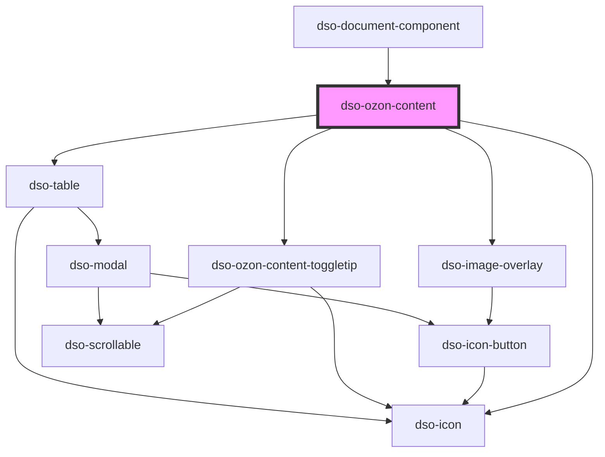

# `<dso-ozon-content>`

Het component `Ozon Content` verwerkt XML van het Toepassingsprofiel omgevingsdocumenten (TPOD) van de Standaard 
Officiële Publicaties(STOP). Deze XML wordt door de Ozon API aangeboden.

## Afbeeldingen
STOP/TPOD kent het `<Illustratie>` element. Dit element bevat de attributen `dpi` en `breedte` en `hoogte`, die 
gebruikt moeten worden om de ruimte te reserveren in het DOM, zodat de Viewer Regels op de Kaart stabiel kan scrollen.

De hoogte en breedte van de afbeelding moeten worden uitgerekend volgens STOP richtlijnen: https://koop.gitlab.io/STOP/standaard/1.4.0-ic/regeltekst_afbeelding.html

Er is een uitzondering: Een afbeelding mag nooit hoger zijn dan de height van de viewport. Er bestaan 
afbeeldingen waar een fout in de content zit. De attributen `hoogte` en `breedte` geven de intrinsieke maten van de 
afbeelding aan. Maar er zijn omgevingsdocumenten waar deze waardes afwijken van de intrinsieke maten, met soms 
astronomische waardes als 17000 pixels. Dit was nooit de bedoeling maar is wel een probleem in de presentatielaag.

Om de planmaker tegemoet te komen maken wij afbeeldingen nooit hoger dan de viewport height.

De gerenderde breedte van een afbeelding is een percentage van de beschikbare breedte van de container waarbinnen 
de afbeelding getoond wordt. Afbeeldingen kunnen niet breder worden dan de container. 

Het component `Image Overlay` wordt ingezet om afbeeldingen (`<Illustratie>`) uit de XML in HTML te renderen.

Zie ook de documentatie van het component Image Overlay

---

<!-- Auto Generated Below -->

## Properties

| Property         | Attribute   | Description                                                                                                                                                                                               | Type                                                           | Default     |
| ---------------- | ----------- | --------------------------------------------------------------------------------------------------------------------------------------------------------------------------------------------------------- | -------------------------------------------------------------- | ----------- |
| `annotated`      | `annotated` | Boolean indicating that this dso-ozon-content is part of an annotated context. If true the content of the toggletip for "IntIoRef" will show a "Kenmerken en kaart" annotation button.                    | `boolean`                                                      | `false`     |
| `begripResolver` | --          | A BegripResolver that will be called for STOP element "IntRef". If the ref-attribute of IntRef points to a Begrip it should return the `<Definitie>` of that Begrip otherwise it should return undefined. | `OzonContentBegripResolver \| undefined`                       | `undefined` |
| `content`        | `content`   | The XML to be rendered.                                                                                                                                                                                   | `XMLDocument \| string \| undefined`                           | `undefined` |
| `inline`         | `inline`    | Setting this property creates dso-ozon-content as inline element instead of a block element.                                                                                                              | `boolean`                                                      | `false`     |
| `mark`           | --          | To mark text.                                                                                                                                                                                             | `((text: string) => MarkTextText[] \| undefined) \| undefined` | `undefined` |
| `urlResolver`    | --          | A UrlResolver that will be called for all STOP elements that render to HTML5 elements with external references.                                                                                           | `OzonContentUrlResolver \| undefined`                          | `undefined` |

## Events

| Event                             | Description                                     | Type                                                                                                                                                            |
| --------------------------------- | ----------------------------------------------- | --------------------------------------------------------------------------------------------------------------------------------------------------------------- |
| `dsoClick`                        | Emitted when an interactive element is clicked. | `CustomEvent<OzonContentClickBaseEvent<"IntIoRef"> \| OzonContentClickBaseEvent<"IntRef"> & { isModifiedEvent: boolean; } \| OzonContentClickBaseEvent<"Kop">>` |
| `dsoOzonContentMarkItemHighlight` | Emitted when a marked item is highlighted.      | `CustomEvent<OzonContentMarkItemHighlightEvent>`                                                                                                                |

## Dependencies

### Used by

 - [dso-document-component](../document-component)

### Depends on

- [dso-icon](../icon)
- [dso-image-overlay](../image-overlay)
- [dso-ozon-content-toggletip](./components/ozon-content-toggletip)
- [dso-table](../table)

### Graph

```mermaid
graph TD;
  dso-ozon-content --> dso-icon
  dso-ozon-content --> dso-image-overlay
  dso-ozon-content --> dso-ozon-content-toggletip
  dso-ozon-content --> dso-table
  dso-image-overlay --> dso-icon-button
  dso-icon-button --> dso-icon
  dso-ozon-content-toggletip --> dso-icon
  dso-ozon-content-toggletip --> dso-scrollable
  dso-table --> dso-modal
  dso-table --> dso-icon
  dso-modal --> dso-scrollable
  dso-modal --> dso-icon-button
  dso-document-component --> dso-ozon-content
  style dso-ozon-content fill:#f9f,stroke:#333,stroke-width:4px
```

----------------------------------------------

*Built with [StencilJS](https://stenciljs.com/)*
