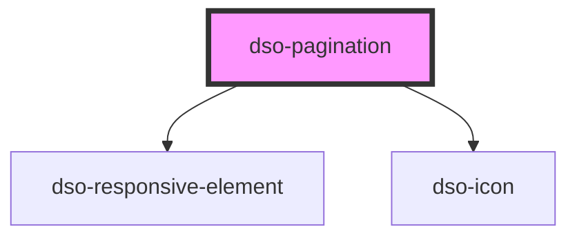

# `<dso-progress-bar>`

<!-- Auto Generated Below -->

## Properties

| Property      | Attribute      | Description                                | Type                       | Default                |
| ------------- | -------------- | ------------------------------------------ | -------------------------- | ---------------------- |
| `currentPage` | `current-page` | Current page                               | `number \| undefined`      | `undefined`            |
| `formatHref`  | --             | This function is called to format the href | `(page: number) => string` | `(page) => "#" + page` |
| `totalPages`  | `total-pages`  | Total pages                                | `number \| undefined`      | `undefined`            |

## Events

| Event           | Description            | Type                                     |
| --------------- | ---------------------- | ---------------------------------------- |
| `dsoSelectPage` | Emitted on page select | `CustomEvent<PaginationSelectPageEvent>` |

## Dependencies

### Depends on

- [dso-responsive-element](../responsive-element)
- [dso-icon](../icon)

### Graph

----------------------------------------------

*Built with [StencilJS](https://stenciljs.com/)*
