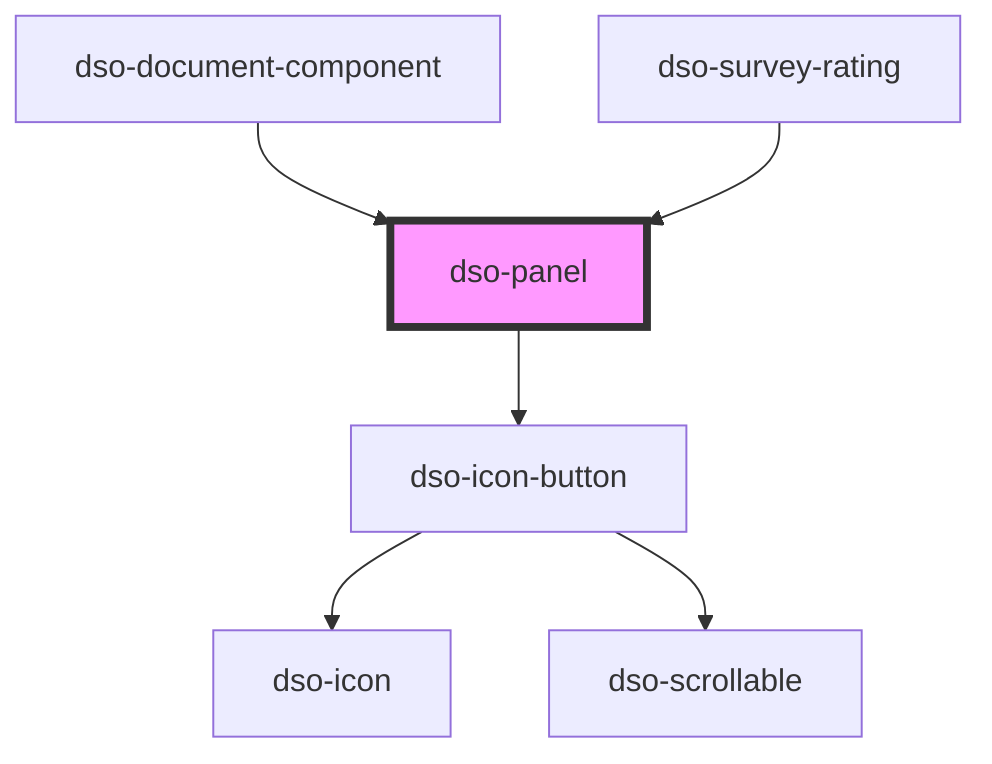

# `<dso-panel>`

<!-- Auto Generated Below -->

## Properties

| Property           | Attribute            | Description                                  | Type                  | Default     |
| ------------------ | -------------------- | -------------------------------------------- | --------------------- | ----------- |
| `closeButtonLabel` | `close-button-label` | The accessible name for the close button.    | `string \| undefined` | `undefined` |
| `emphasized`       | `emphasized`         | To display the panel as an emphasized panel. | `boolean`             | `false`     |

## Events

| Event           | Description                                   | Type                           |
| --------------- | --------------------------------------------- | ------------------------------ |
| `dsoCloseClick` | Emitted when the user click the close button. | `CustomEvent<PanelCloseEvent>` |

## Slots

| Slot        | Description                                       |
| ----------- | ------------------------------------------------- |
|             | The contents to be highlighted within the panel   |
| `"heading"` | The heading (h2 - h6) with the title of the panel |

## Dependencies

### Used by

 - [dso-document-component](../document-component)
 - [dso-survey-rating](../survey-rating)

### Depends on

- [dso-icon-button](../icon-button)

### Graph

----------------------------------------------

*Built with [StencilJS](https://stenciljs.com/)*
