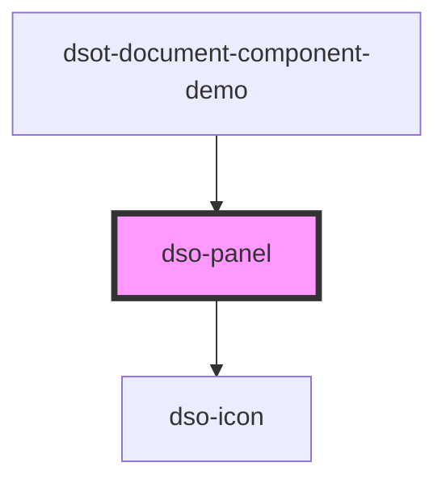

# `<dso-panel>`

<!-- Auto Generated Below -->

## Events

| Event           | Description                                   | Type                           |
| --------------- | --------------------------------------------- | ------------------------------ |
| `dsoCloseClick` | Emitted when the user click the close button. | `CustomEvent<PanelCloseEvent>` |

## Slots

| Slot        | Description                                       |
| ----------- | ------------------------------------------------- |
|             | The contents to be highlighted within the panel   |
| `"heading"` | The heading (h2 - h6) with the title of the panel |

## Dependencies

### Used by

 - [dsot-document-component-demo](../document-component-demo)

### Depends on

- [dso-icon](../icon)

### Graph

----------------------------------------------

*Built with [StencilJS](https://stenciljs.com/)*
