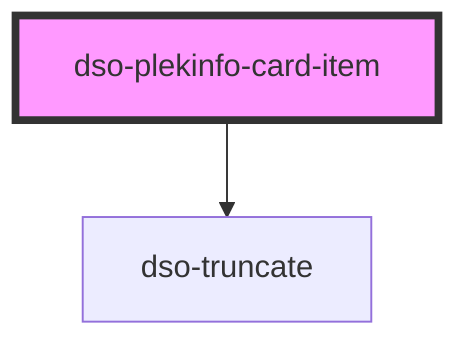

# dso-plekinfo-card-item

<!-- Auto Generated Below -->

## Properties

| Property      | Attribute     | Description                                                                      | Type                                    | Default     |
| ------------- | ------------- | -------------------------------------------------------------------------------- | --------------------------------------- | ----------- |
| `wijzigactie` | `wijzigactie` | An optional 'wijzigactie' that signals if the plekinfo item is added or removed. | `"verwijder" \| "voegtoe" \| undefined` | `undefined` |

## Slots

| Slot         | Description                                                            |
| ------------ | ---------------------------------------------------------------------- |
| `"label"`    | The label of the plekinfo item.                                        |
| `"meta"`     | An optional label badge displayed after the label and sublabel.        |
| `"sublabel"` | An optional sublabel of the plekinfo item.                             |
| `"symbol"`   | A mandatory slot to place a symbol in, representing the plekinfo item. |

## Dependencies

### Depends on

- [dso-truncate](../../truncate)

### Graph

----------------------------------------------

*Built with [StencilJS](https://stenciljs.com/)*
