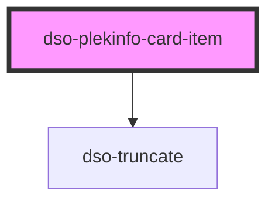

# `<dso-plekinfo-card-item>`

Eén regel in een Plekinfo Card: een symbool, een label, een optioneel sublabel en optioneel een Label als meta. Gebruik
Plekinfo Card Item alleen in het slot `content` van een Plekinfo Card.

Label en sublabel staan samen in één Truncate. Past de tekst niet, dan eindigt de regel op een ellipsis en toont de
tooltip label en sublabel volledig.

<!-- Auto Generated Below -->

## Properties

| Property      | Attribute     | Description                                                                      | Type                                    | Default     |
| ------------- | ------------- | -------------------------------------------------------------------------------- | --------------------------------------- | ----------- |
| `wijzigactie` | `wijzigactie` | An optional 'wijzigactie' that signals if the plekinfo item is added or removed. | `"verwijder" \| "voegtoe" \| undefined` | `undefined` |

## Slots

| Slot         | Description                                                     |
| ------------ | --------------------------------------------------------------- |
| `"label"`    | The label of the plekinfo item.                                 |
| `"meta"`     | An optional label badge displayed after the label and sublabel. |
| `"sublabel"` | An optional sublabel of the plekinfo item.                      |
| `"symbol"`   | A required slot for the symbol representing this plekinfo item. |

## Dependencies

### Depends on

- [dso-truncate](../../truncate)

### Graph

----------------------------------------------

*Built with [StencilJS](https://stenciljs.com/)*
