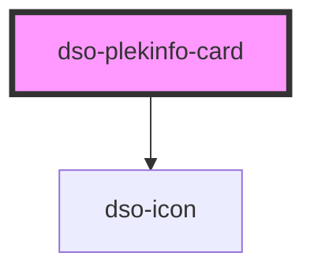

# dso-plekinfo-card

<!-- Auto Generated Below -->

## Properties

| Property            | Attribute     | Description                                                                        | Type                                    | Default     |
| ------------------- | ------------- | ---------------------------------------------------------------------------------- | --------------------------------------- | ----------- |
| `active`            | `active`      | Makes the PlekinfoCard active.                                                     | `boolean \| undefined`                  | `undefined` |
| `href` _(required)_ | `href`        | The URL to which the PlekinfoCard heading links.                                   | `string \| undefined`                   | `undefined` |
| `wijzigactie`       | `wijzigactie` | Een optionele wijzigactie die aangeeft of de plekinfo is toegevoegd of verwijderd. | `"verwijder" \| "voegtoe" \| undefined` | `undefined` |

## Events

| Event                  | Description                                       | Type                                     |
| ---------------------- | ------------------------------------------------- | ---------------------------------------- |
| `dsoPlekinfoCardClick` | Emitted when the PlekinfoCard heading is clicked. | `CustomEvent<DsoPlekinfoCardClickEvent>` |

## Dependencies

### Depends on

- [dso-icon](../icon)

### Graph

----------------------------------------------

*Built with [StencilJS](https://stenciljs.com/)*
