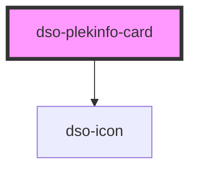

# `<dso-plekinfo-card>`

<!-- Auto Generated Below -->

## Properties

| Property            | Attribute      | Description                                                                             | Type                                    | Default     |
| ------------------- | -------------- | --------------------------------------------------------------------------------------- | --------------------------------------- | ----------- |
| `active`            | `active`       | Makes the PlekinfoCard active.                                                          | `boolean \| undefined`                  | `undefined` |
| `href` _(required)_ | `href`         | The URL to which the PlekinfoCard heading links.                                        | `string \| undefined`                   | `undefined` |
| `targetBlank`       | `target-blank` | Opens the urls in a new window or tab                                                   | `boolean`                               | `false`     |
| `wijzigactie`       | `wijzigactie`  | An optional 'wijzigactie' that signals if the plekinfo on the card is added or removed. | `"verwijder" \| "voegtoe" \| undefined` | `undefined` |

## Events

| Event                  | Description                                       | Type                                  |
| ---------------------- | ------------------------------------------------- | ------------------------------------- |
| `dsoPlekinfoCardClick` | Emitted when the PlekinfoCard heading is clicked. | `CustomEvent<PlekinfoCardClickEvent>` |

## Slots

| Slot             | Description                                                                           |
| ---------------- | ------------------------------------------------------------------------------------- |
| `"content"`      | An optional slot to place `Rich Content` in.                                          |
| `"heading"`      | A slot to place the title of the card in.                                             |
| `"interactions"` | An optional slot for one or more `Button`s, `Label`s, `Toggletip`s or `SlideToggle`s. |
| `"meta"`         | An optional slot to place a `Label` in.                                               |
| `"symbol"`       | An optional slot to place a symbol, representing the plekinfo item, in.               |

## Dependencies

### Depends on

- [dso-icon](../icon)

### Graph

----------------------------------------------

*Built with [StencilJS](https://stenciljs.com/)*
