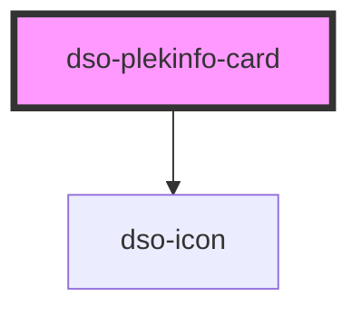

# `<dso-plekinfo-card>`

<!-- Auto Generated dso-toolkit -->

## Types

### PlekinfoCardClickEvent

```typescript
export interface PlekinfoCardClickEvent {
  originalEvent: MouseEvent;
  /** True when user clicked the card while holding Ctrl, Alt or other modifiers, or when the card is right-clicked. Can be used to determine navigation. */
  isModifiedEvent: boolean;
}
```

<!-- src/components/plekinfo-card/plekinfo-card.interfaces.ts::PlekinfoCardClickEvent -->

### PlekinfoWijzigactie

```typescript
export type PlekinfoWijzigactie = "voegtoe" | "verwijder";
```

<!-- src/components/plekinfo-card/plekinfo-card.interfaces.ts::PlekinfoWijzigactie -->

<!-- Auto Generated Below -->

## Properties

| Property            | Attribute      | Description                                                                             | Type                                    | Default     |
| ------------------- | -------------- | --------------------------------------------------------------------------------------- | --------------------------------------- | ----------- |
| `active`            | `active`       | Makes the PlekinfoCard active.                                                          | `boolean \| undefined`                  | `undefined` |
| `href` _(required)_ | `href`         | The URL to which the PlekinfoCard heading links.                                        | `string \| undefined`                   | `undefined` |
| `targetBlank`       | `target-blank` | Opens the urls in a new window or tab                                                   | `boolean`                               | `false`     |
| `wijzigactie`       | `wijzigactie`  | An optional 'wijzigactie' that signals if the plekinfo on the card is added or removed. | `"verwijder" \| "voegtoe" \| undefined` | `undefined` |

## Events

| Event                  | Description                                       | Type                                  |
| ---------------------- | ------------------------------------------------- | ------------------------------------- |
| `dsoPlekinfoCardClick` | Emitted when the PlekinfoCard heading is clicked. | `CustomEvent<PlekinfoCardClickEvent>` |

## Slots

| Slot            | Description                                                             |
| --------------- | ----------------------------------------------------------------------- |
| `"content"`     | An optional slot to place `Rich Content` in.                            |
| `"heading"`     | A slot to place the title of the card in.                               |
| `"interaction"` | A slot for the `SlideToggle`s elments.                                  |
| `"meta"`        | An optional slot to place a `Label` in.                                 |
| `"symbol"`      | An optional slot to place a symbol, representing the plekinfo item, in. |

## Dependencies

### Depends on

- [dso-icon](../icon)

### Graph



---

_Built with [StencilJS](https://stenciljs.com/)_
