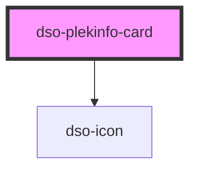

# `<dso-plekinfo-card>`

<!-- Auto Generated Below -->

## Properties

| Property            | Attribute      | Description                                                                             | Type                                    | Default     |
| ------------------- | -------------- | --------------------------------------------------------------------------------------- | --------------------------------------- | ----------- |
| `active`            | `active`       | Makes the PlekinfoCard active.                                                          | `boolean \| undefined`                  | `undefined` |
| `href` _(required)_ | `href`         | The URL to which the PlekinfoCard heading links.                                        | `string \| undefined`                   | `undefined` |
| `noStroke`          | `no-stroke`    | Hides the bottom border (stroke) of the card.                                           | `boolean`                               | `false`     |
| `targetBlank`       | `target-blank` | Opens the urls in a new window or tab                                                   | `boolean`                               | `false`     |
| `wijzigactie`       | `wijzigactie`  | An optional 'wijzigactie' that signals if the plekinfo on the card is added or removed. | `"verwijder" \| "voegtoe" \| undefined` | `undefined` |

## Events

| Event                  | Description                                       | Type                                  |
| ---------------------- | ------------------------------------------------- | ------------------------------------- |
| `dsoPlekinfoCardClick` | Emitted when the PlekinfoCard heading is clicked. | `CustomEvent<PlekinfoCardClickEvent>` |

## Slots

| Slot            | Description                                                                                 |
| --------------- | ------------------------------------------------------------------------------------------- |
| `"content"`     | A slot for rich content or `PlekinfoCardItem`s. These content types are mutually exclusive. |
| `"heading"`     | A slot to place the title of the card in.                                                   |
| `"interaction"` | A slot for the `SlideToggle` element.                                                       |
| `"meta"`        | An optional slot to place a `Label` in.                                                     |
| `"symbol"`      | A symbol for the card. Mutually exclusive with items.                                       |

## Dependencies

### Depends on

- [dso-icon](../icon)

### Graph

```mermaid
graph TD;
  dso-plekinfo-card --> dso-icon
  style dso-plekinfo-card fill:#f9f,stroke:#333,stroke-width:4px
```

----------------------------------------------

*Built with [StencilJS](https://stenciljs.com/)*
