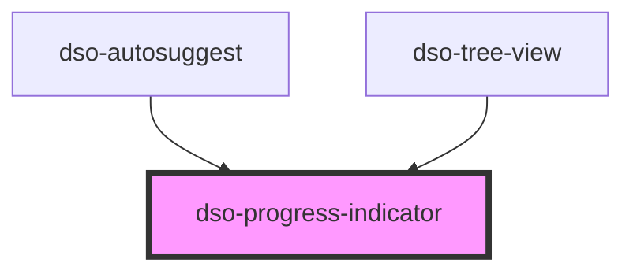

# `<dso-progress-indicator>`

- toevoeging attribute `block` zorgt voor horizontaal en verticaal gecentreerde progress-indicator;
- icm. `size="small"` zorgt dit voor een (afhankelijk van de inhoud) minimaal 48px hoge progress indicator;
- icm. `size="medium"` zorgt dit voor een (afhankelijk van de inhoud) minimaal 64px hoge progress indicator;
- icm. `size="large"` zorgt dit voor een (afhankelijk van de inhoud) minimaal 96px hoge progress indicator;

<!-- Auto Generated Below -->

## Properties

| Property | Attribute | Description | Type                                          | Default     |
| -------- | --------- | ----------- | --------------------------------------------- | ----------- |
| `block`  | `block`   |             | `boolean \| undefined`                        | `undefined` |
| `label`  | `label`   |             | `string \| undefined`                         | `undefined` |
| `size`   | `size`    |             | `"large" \| "medium" \| "small" \| undefined` | `undefined` |

## Dependencies

### Used by

 - [dso-autosuggest](../autosuggest)
 - [dso-tree-view](../tree-view)

### Graph

----------------------------------------------

*Built with [StencilJS](https://stenciljs.com/)*
