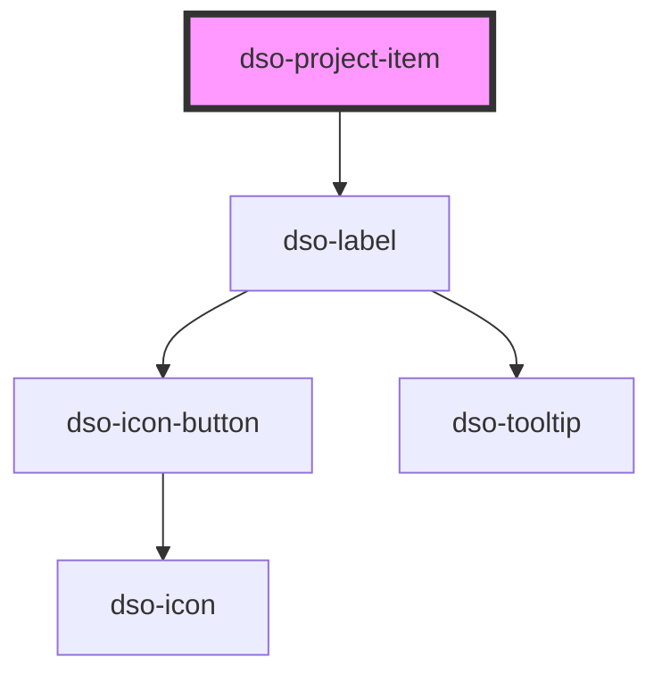

# `<dso-project-item>`

<!-- Auto Generated Below -->

## Properties

| Property | Attribute | Description                    | Type                  | Default     |
| -------- | --------- | ------------------------------ | --------------------- | ----------- |
| `label`  | `label`   | The label of the project item. | `string \| undefined` | `undefined` |

## Dependencies

### Depends on

- [dso-label](../label)

### Graph

----------------------------------------------

*Built with [StencilJS](https://stenciljs.com/)*
