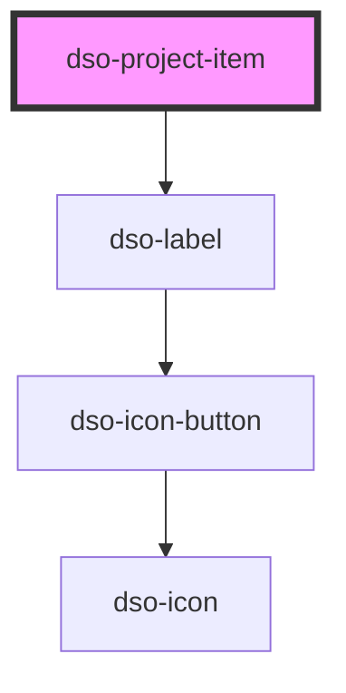

# `<dso-project-item>`

<!-- Auto Generated Below -->

## Properties

| Property | Attribute | Description                    | Type                  | Default     |
| -------- | --------- | ------------------------------ | --------------------- | ----------- |
| `label`  | `label`   | The label of the project item. | `string \| undefined` | `undefined` |

## Slots

| Slot         | Description                                                  |
| ------------ | ------------------------------------------------------------ |
| `"actions"`  | An optional slot to place interactive actions or buttons in. |
| `"progress"` | An optional slot to place progress indicators or labels in.  |
| `"status"`   | An optional slot to place status indicators or metadata in.  |
| `"title"`    | A slot to place the title of the project item in.            |

## Dependencies

### Depends on

- [dso-label](../label)

### Graph

```mermaid
graph TD;
  dso-project-item --> dso-label
  dso-label --> dso-icon-button
  dso-icon-button --> dso-icon
  style dso-project-item fill:#f9f,stroke:#333,stroke-width:4px
```

----------------------------------------------

*Built with [StencilJS](https://stenciljs.com/)*
