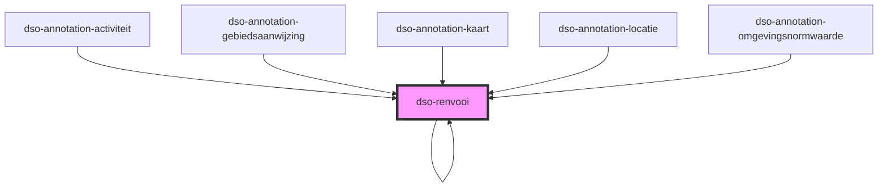

# dso-renvooi

Met dit component kan een `RenvooiValue` worden gepresenteerd.

<!-- Auto Generated Below -->

## Properties

| Property | Attribute | Description                  | Type                                                                                                                             | Default     |
| -------- | --------- | ---------------------------- | -------------------------------------------------------------------------------------------------------------------------------- | ----------- |
| `value`  | `value`   | The renvooi value to render. | `RenvooiValue[] \| string \| undefined \| { toegevoegd: string; } \| { verwijderd: string; } \| { was: string; wordt: string; }` | `undefined` |

## Dependencies

### Used by

 - [dso-annotation-activiteit](../annotation/annotation-activiteit)
 - [dso-annotation-gebiedsaanwijzing](../annotation/annotation-gebiedsaanwijzing)
 - [dso-annotation-kaart](../annotation/annotation-kaart)
 - [dso-annotation-locatie](../annotation/annotation-locatie)
 - [dso-annotation-omgevingsnormwaarde](../annotation/annotation-omgevingsnormwaarde)
 - [dso-renvooi](.)

### Depends on

- [dso-renvooi](.)

### Graph

----------------------------------------------

*Built with [StencilJS](https://stenciljs.com/)*
