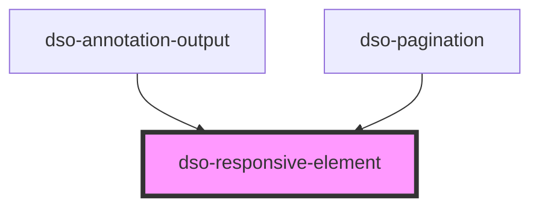

# `<dso-responsive-element>`

<!-- Auto Generated Below -->

## Events

| Event           | Description | Type                                          |
| --------------- | ----------- | --------------------------------------------- |
| `dsoSizeChange` |             | `CustomEvent<"large" \| "medium" \| "small">` |

## Methods

### `getSize() => Promise<ResponsiveElementSize>`

#### Returns

Type: `Promise<ResponsiveElementSize>`

The current size

## Dependencies

### Used by

 - [dso-annotation-output](../annotation-output)
 - [dso-pagination](../pagination)

### Graph

----------------------------------------------

*Built with [StencilJS](https://stenciljs.com/)*
