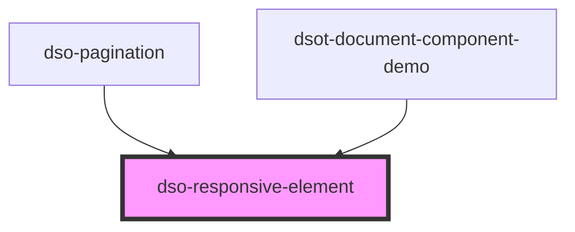

# `<dso-responsive-element>`

<!-- Auto Generated dso-toolkit -->

## Types

### ResponsiveElementSize

```typescript
export type ResponsiveElementSize = "small" | "medium" | "large";
```

<!-- src/components/responsive-element/responsive-element.interfaces.ts::ResponsiveElementSize -->

<!-- Auto Generated Below -->

## Events

| Event           | Description                   | Type                                          |
| --------------- | ----------------------------- | --------------------------------------------- |
| `dsoSizeChange` | Emitted when size has changed | `CustomEvent<"large" \| "medium" \| "small">` |

## Methods

### `getSize() => Promise<ResponsiveElementSize>`

The current size

#### Returns

Type: `Promise<ResponsiveElementSize>`

## Dependencies

### Used by

- [dso-pagination](../pagination)
- [dsot-document-component-demo](../document-component-demo)

### Graph



---

_Built with [StencilJS](https://stenciljs.com/)_
