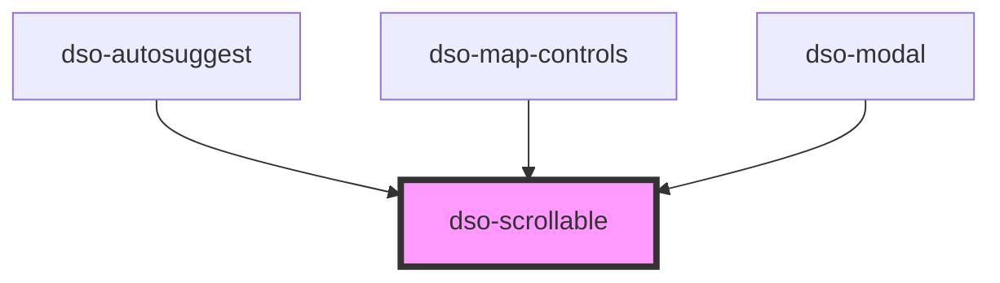

# `<dso-scrollable>`

<!-- Auto Generated Below -->

## Events

| Event          | Description                                                 | Type                             |
| -------------- | ----------------------------------------------------------- | -------------------------------- |
| `dsoScrollEnd` | Event emitted when the scrollbar has reached top or bottom. | `CustomEvent<DsoScrollEndEvent>` |

## Dependencies

### Used by

 - [dso-autosuggest](../autosuggest)
 - [dso-map-controls](../map-controls)
 - [dso-modal](../modal)

### Graph

----------------------------------------------

*Built with [StencilJS](https://stenciljs.com/)*
