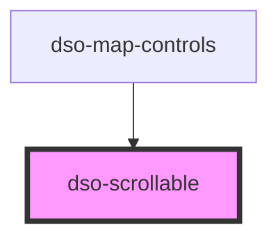

# `<dso-scrollable>`

<!-- Auto Generated Below -->

## Events

| Event                | Description                                                 | Type                                             |
| -------------------- | ----------------------------------------------------------- | ------------------------------------------------ |
| `dsoScrollableEvent` | Event emitted when the scrollbar has reached top or bottom. | `CustomEvent<{ scrollEnd: "top" \| "bottom"; }>` |

## Methods

### `_setScrollState(target: HTMLDivElement) => Promise<void>`

Internal method. Do not use.

#### Returns

Type: `Promise<void>`

## Dependencies

### Used by

 - [dso-map-controls](../map-controls)

### Graph

----------------------------------------------

*Built with [StencilJS](https://stenciljs.com/)*
