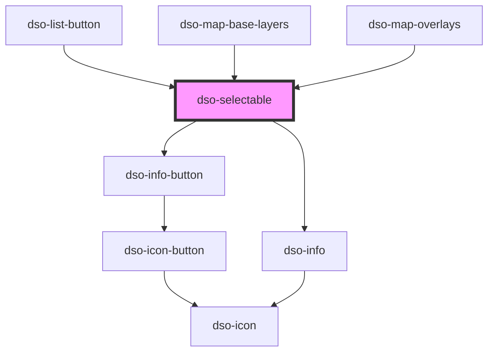

# `<dso-selectable>`

`interface SelectableChangeEvent` is structurally identical to `Event`.

<!-- Auto Generated Below -->

## Properties

| Property             | Attribute         | Description                                                                                                                                                                       | Type                    | Default     |
| -------------------- | ----------------- | --------------------------------------------------------------------------------------------------------------------------------------------------------------------------------- | ----------------------- | ----------- |
| `checked`            | `checked`         | Mark the Selectable as checked                                                                                                                                                    | `boolean \| undefined`  | `undefined` |
| `describedById`      | `described-by-id` | To link this control to an element that describes it.                                                                                                                             | `string \| undefined`   | `undefined` |
| `disabled`           | `disabled`        | To disable the Selectable.                                                                                                                                                        | `boolean \| undefined`  | `undefined` |
| `identifier`         | `identifier`      | To set `<input id>` attribute for external references.                                                                                                                            | `string \| undefined`   | `undefined` |
| `indeterminate`      | `indeterminate`   | An indeterminate state is neither true or false. It means the answer is somewhere in between.  Can be used to indicate child Selectables that are a mix of checked and unchecked. | `boolean \| undefined`  | `undefined` |
| `infoFixed`          | `info-fixed`      | Set to true if the Info should not be toggled and always visible.                                                                                                                 | `boolean \| undefined`  | `undefined` |
| `invalid`            | `invalid`         | Set to true of the current value is not valid.                                                                                                                                    | `boolean \| undefined`  | `undefined` |
| `labelledById`       | `labelled-by-id`  | To link this control to an element that labels it.                                                                                                                                | `string \| undefined`   | `undefined` |
| `name`               | `name`            | Name of the Selectable. Can be used to group Selectables.                                                                                                                         | `string \| undefined`   | `undefined` |
| `required`           | `required`        | To mark the Selectable as required.                                                                                                                                               | `boolean \| undefined`  | `undefined` |
| `type` _(required)_  | `type`            | Type of Selectable.  `checkbox`: Multiple options `radio`: Single option.                                                                                                         | `"checkbox" \| "radio"` | `undefined` |
| `value` _(required)_ | `value`           | The value of the Selectable.                                                                                                                                                      | `string`                | `undefined` |

## Events

| Event       | Description                                              | Type                                 |
| ----------- | -------------------------------------------------------- | ------------------------------------ |
| `dsoChange` | Emitted when the user checks or unchecks the Selectable. | `CustomEvent<SelectableChangeEvent>` |

## Methods

### `toggleInfo(active?: boolean) => Promise<void>`

Method to toggle the Info. Is set to `active` when passed.

If `active` is not passed, Info is toggled to opposite value.

#### Parameters

| Name     | Type                   | Description |
| -------- | ---------------------- | ----------- |
| `active` | `boolean \| undefined` |             |

#### Returns

Type: `Promise<void>`

## Slots

| Slot        | Description                                                                                                                       |
| ----------- | --------------------------------------------------------------------------------------------------------------------------------- |
|             | The label for this control                                                                                                        |
| `"info"`    | Rich Content to be slotted in Info.                                                                                               |
| `"options"` | for further nested selectable options: `<ul class="dso-selectable-options" slot="options">` and wrap each Selectable in a `<li>`. |

## Dependencies

### Used by

 - [dso-list-button](../list-button)
 - [dso-map-base-layers](../map-base-layers)
 - [dso-map-overlays](../map-overlays)

### Depends on

- [dso-info-button](../info-button)
- [dso-info](../info)

### Graph

----------------------------------------------

*Built with [StencilJS](https://stenciljs.com/)*
