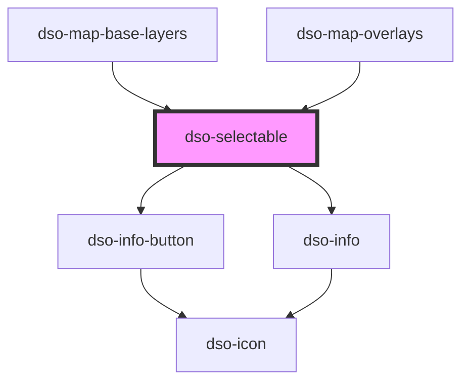

# `<dso-selectable>`

`interface SelectableChangeEvent` is structurally identical to `Event`.

<!-- Auto Generated Below -->

## Properties

| Property             | Attribute         | Description | Type                    | Default     |
| -------------------- | ----------------- | ----------- | ----------------------- | ----------- |
| `checked`            | `checked`         |             | `boolean \| undefined`  | `undefined` |
| `describedById`      | `described-by-id` |             | `string \| undefined`   | `undefined` |
| `disabled`           | `disabled`        |             | `boolean \| undefined`  | `undefined` |
| `identifier`         | `identifier`      |             | `string \| undefined`   | `undefined` |
| `indeterminate`      | `indeterminate`   |             | `boolean \| undefined`  | `undefined` |
| `infoFixed`          | `info-fixed`      |             | `boolean \| undefined`  | `undefined` |
| `invalid`            | `invalid`         |             | `boolean \| undefined`  | `undefined` |
| `name`               | `name`            |             | `string \| undefined`   | `undefined` |
| `required`           | `required`        |             | `boolean \| undefined`  | `undefined` |
| `type` _(required)_  | `type`            |             | `"checkbox" \| "radio"` | `undefined` |
| `value` _(required)_ | `value`           |             | `string`                | `undefined` |

## Events

| Event       | Description | Type                                 |
| ----------- | ----------- | ------------------------------------ |
| `dsoChange` |             | `CustomEvent<SelectableChangeEvent>` |

## Methods

### `toggleInfo(active?: boolean | undefined) => Promise<void>`

#### Returns

Type: `Promise<void>`

## Dependencies

### Used by

 - [dso-map-base-layers](../map-base-layers)
 - [dso-map-overlays](../map-overlays)

### Depends on

- [dso-info-button](../info-button)
- [dso-info](../info)

### Graph

----------------------------------------------

*Built with [StencilJS](https://stenciljs.com/)*
