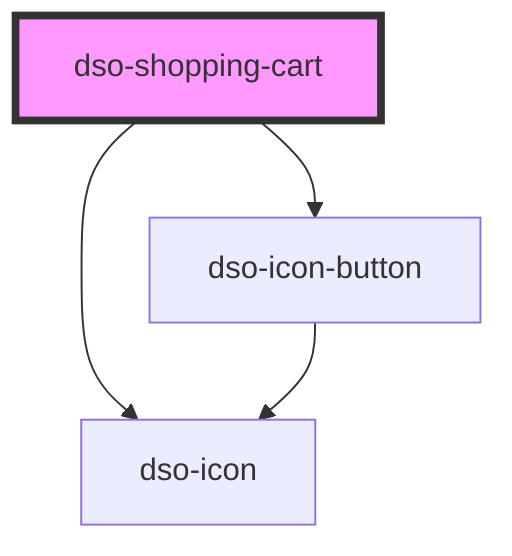

# `<dso-shopping-cart>`

Zie de voorbeeldpagina's onder Patronen voor hoe de Shopping Cart samenwerkt met `<dso-grid-column>`.

<!-- Auto Generated Below -->

## Properties

| Property     | Attribute    | Description                                                                                                                                                                | Type               | Default  |
| ------------ | ------------ | -------------------------------------------------------------------------------------------------------------------------------------------------------------------------- | ------------------ | -------- |
| `mode`       | `mode`       | The mode of the Shopping Cart.                                                                                                                                             | `"main" \| "side"` | `"side"` |
| `toggleable` | `toggleable` | When set, a toggle button is rendered. In the `side` mode this is a button to expand the Shopping Cart, in the `main` mode this is a button to collapse the Shopping Cart. | `boolean`          | `false`  |

## Events

| Event       | Description                                                                                                                | Type                                   |
| ----------- | -------------------------------------------------------------------------------------------------------------------------- | -------------------------------------- |
| `dsoToggle` | Emitted when the user clicks the toggle button (the button in the `side` mode or the "Sluiten" button in the `main` mode). | `CustomEvent<ShoppingCartToggleEvent>` |

## Slots

| Slot        | Description                                                                                                                   |
| ----------- | ----------------------------------------------------------------------------------------------------------------------------- |
|             | The slot to place the `dso-shopping-cart-item` elements in.                                                                   |
| `"heading"` | The title of the Shopping Cart, as a heading element (e.g. `<h3 slot="heading">`) matching the heading hierarchy of the page. |

## Dependencies

### Depends on

- [dso-icon](../icon)
- [dso-icon-button](../icon-button)

### Graph

----------------------------------------------

*Built with [StencilJS](https://stenciljs.com/)*
