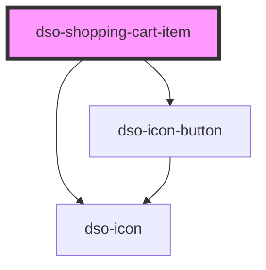

# `<dso-shopping-cart-item>`

 
<!-- Auto Generated Below -->

## Properties

| Property    | Attribute   | Description                                          | Type               | Default  |
| ----------- | ----------- | ---------------------------------------------------- | ------------------ | -------- |
| `editable`  | `editable`  | When set an edit (pencil) action is rendered.        | `boolean`          | `false`  |
| `mode`      | `mode`      | The mode of the Shopping Cart Item.                  | `"edit" \| "view"` | `"view"` |
| `removable` | `removable` | When set a delete (trash) action is rendered.        | `boolean`          | `false`  |
| `warning`   | `warning`   | When set a warning icon is rendered before the name. | `boolean`          | `false`  |

## Events

| Event       | Description                                                       | Type                                       |
| ----------- | ----------------------------------------------------------------- | ------------------------------------------ |
| `dsoClose`  | Emitted when the user clicks the close button in the `edit` mode. | `CustomEvent<ShoppingCartItemCloseEvent>`  |
| `dsoDelete` | Emitted when the user clicks the delete (trash) action.           | `CustomEvent<ShoppingCartItemDeleteEvent>` |
| `dsoEdit`   | Emitted when the user clicks the edit (pencil) action.            | `CustomEvent<ShoppingCartItemEditEvent>`   |

## Slots

| Slot     | Description                                                                                                                                                                                                                           |
| -------- | ------------------------------------------------------------------------------------------------------------------------------------------------------------------------------------------------------------------------------------- |
|          | In the `edit` mode it holds the form content. In the `view` mode it can hold nested Shopping Cart Items, which render as sub items.                                                                                                   |
| `"info"` | An optional line of information shown below the name.                                                                                                                                                                                 |
| `"name"` | The name of the item. In the `edit` mode it is the title of the form; use a heading element (e.g. `<h4 slot="name">`) matching the heading hierarchy of the page. The text is also used in the labels of the edit and delete actions. |

## Dependencies

### Depends on

- [dso-icon](../../icon)
- [dso-icon-button](../../icon-button)

### Graph

----------------------------------------------

*Built with [StencilJS](https://stenciljs.com/)*
